## Final Project: Bank Heist

### The Idea and Result

So, how did this idea spring up in my head? Well, I'm not really sure, either. Initially, I was planning on doing something similar to the Tap Tap series (basically games that you had to tap the right beats to a song) using either the buttons or photoresistors, which is something entirely different from this. But I guess what stopped me from doing it was because it was something that had already been done and I knew how to implement it. I dunno why I do this to myself, but I wanted to try something that hadn't been done (or at least to my knowledge). So I fiddled around with the sensors, thinking about what they could do and how I could make it into a game or a contraption of some sort. I knew that making something like an RC car was a possibility, but I never really explored it because I didn't want to burn down *all* the bridges behind me, ya know?

Well, that's when I remembered being bummed that the potentiometer only turned like 270 degrees or something rather than turning all 360. I thought that it'd have been cool to make it into a dial of some kind, then *boom*. I thought I could make a vault dial with the thing. One thing led to another and I came up with the idea of a game simulating a bank heist, whose final stage (or second to last) would be opening a vault.

So, the game. It's a bank heist simulation that consists of two stages (look at the journal to see how many I wanted to make vs the actual number I made because of my lack of experience with Arduino and debugging), a keypad (presumably for a door) and a vault dial. There's a timer going on in the background, and when it reaches 0 you lose. Also, if you mess up while working, you will either lose time or lose the game (depends on difficulty, read on). If you don't want to read through the entire rundown, then [here's](https://drive.google.com/file/d/12iUUBkXA2SrMG78O81LMNwvz7-xeCH5i/view?usp=sharing) a video of me ~~cheating through~~ playing the game.

#### The Menu

I can't say that I'm overjoyed with how things turned out, seeing as I wasn't able to add all the stages I wanted to, but it's still fun to play. Here are screeshots of the game's menu screen:

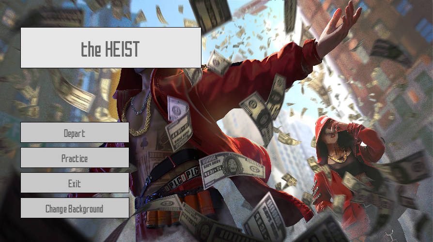

As you can see, the UI for the menu is pretty similar to that of my midterm project, SAO: ReVisited. That's because it's pretty much the same code that I created for the UI on that project. I spent hours making a block of code that would dynamically create a menu based on the inputs of an inital location and I thought it was a waste not to use it. Maybe recoloring it might've been a cool idea, though. Anyway, the features are the same. Instructions, changing the background, the music for the menu, all of it's there. Okay, so on to the main game.

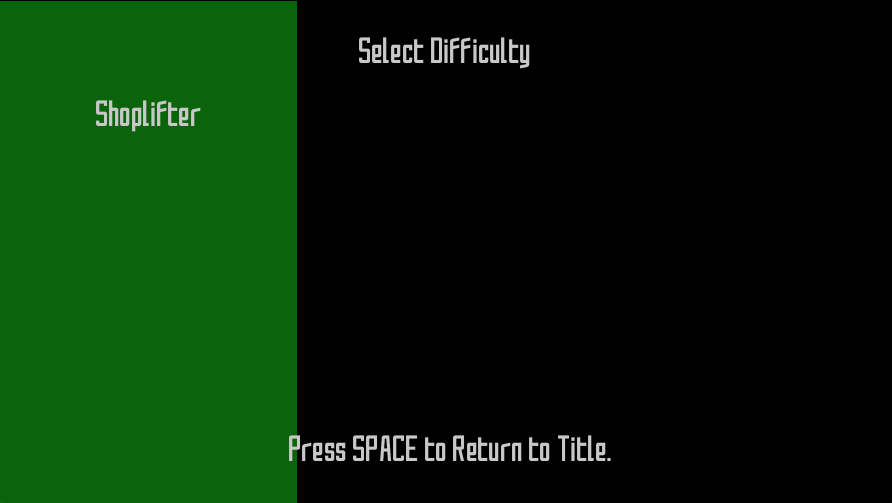
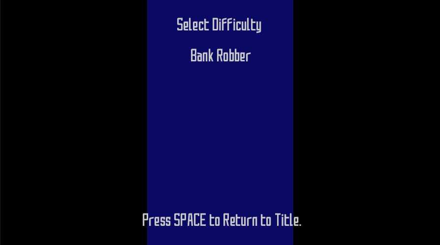
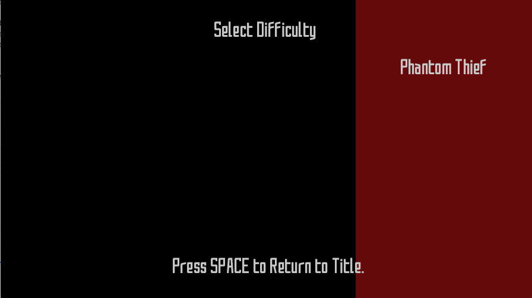

This is what you get when you hit "Depart": the difficulty selection screen. I was planning on having animations on it, just like my midterm project, but I didn't have the time so I just made it differentiated by colors. Anyway, three difficulties, each has different penalties for mistakes. The easiest stage (Shoplifter) gives you the most time and the least penalties, the normal stage (Bank Robber) a little less time and a little more penalties, and the extreme stage (Phantom Thief) the least time and harshest penalty (you lose automatically if you make a single mistake). So, pick and choose your stage, then we move onto the first stage: the keypad.

#### The Keypad

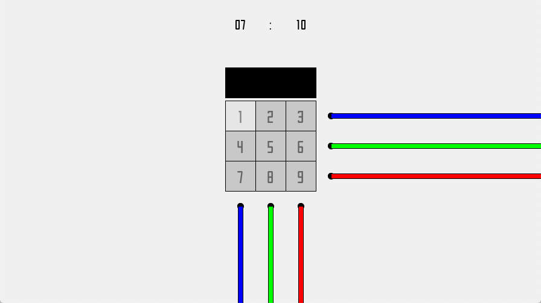

So, the stage is comprised of two parts, the Processing end and the Arduino end. When the stage starts, the Arduino creates a randomly generated code for the passcode and sends it to Processing, which receives it and decrypts it into the actual passcode. The encryption is very simple; it's a matrix of numbers from 1-9, which happens to be what the keypad is. I tried to make this connection a little bit less subtle (but still hard to get right away) by adding the colored wires, which imply that it may just be a matrix. In order to solve this, the player needs to go to the Arduino and play a light game, which starts with a button press. The lights will be in pairs of 2, incremented by 2 each stage. Once you reach the end of the game, a button push will show the entire code (the coordinates) again. With this information, you need to unlock the keypad by matching the light pairs to their digits; the first is the row, the second the column. Getting the code wrong will result in your time being decreased, but getting it right will make the numbers flash green. Finish that, and you'll know.

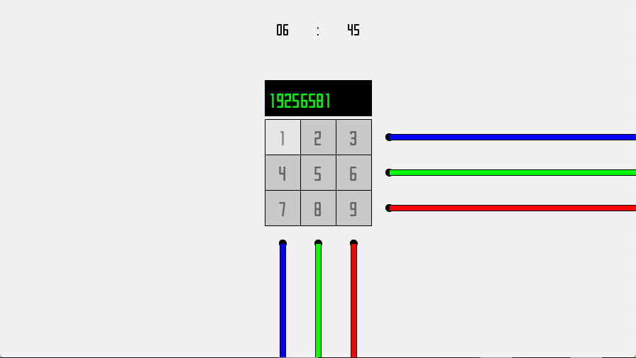

Then you move on to the second (and last) stage, the vault, which uses the buttons and the potentiometer.

#### The Vault

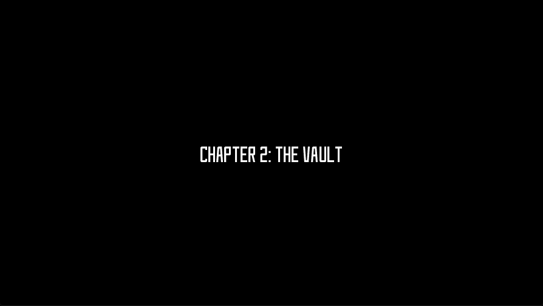
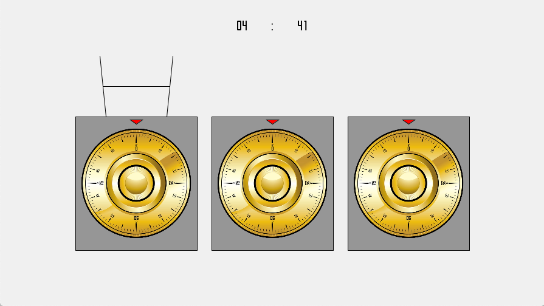

The vault is what took the most time to code as it required a lot of moving parts. There's the water cup, which tells you if you have the right digit or not as well as which vault you've selected (selection can be made using the buttons on the Arduino), and there's the dial. Not to mention there are *three* dials. Here, you need to put on your ~~stethoscope~~ earphones and *listen*. I actually recommend you start the game with earphones, because the first click will occur in the chapter intro screen. The game will tell you which dial you need to work on (next) when you reach the right digit on the right dial by using audio panning. Also, don't turn the dial too fast or you might lose your grip ;P

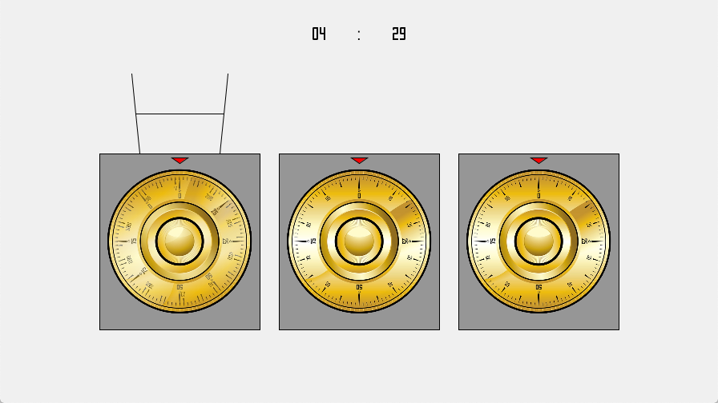

When you change dials, your last position will be saved until you get back to it. In order to start a dial, you need to match the potentiometer to the last position that the dial was in (you'll know because of the ghost dial, which keeps track of your current position) before it starts moving along with your input. Anyway, whenever you complete a dial, the red arrow at the top of the dial will turn green (this will take some time, as there are 10 digits to a dial–– making 30 digits total for the vault stage passcode). Complete all the dials, and you'll know. There's a satisfying clack.

#### The End

And that's the game! You can reset the game by clicking the SPACE bar, which the game tells you after a while. I suddenly just realized that I've basically written a walkthrough of the game, which is *not* what I was planning to do. I feel like I've become one of those IGN guides or something...

Also, if you're wondering, when you lose the game it looks like this.

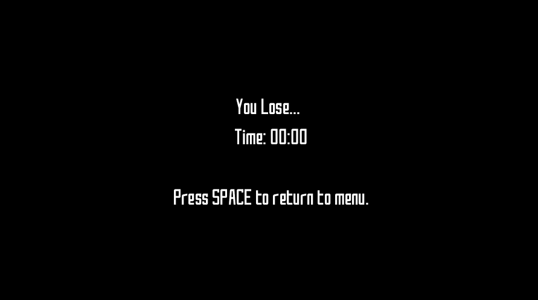

To get a better grasp of the game, [here's](https://drive.google.com/file/d/12iUUBkXA2SrMG78O81LMNwvz7-xeCH5i/view?usp=sharing) a demo ~~of me cheating through the entire game~~.

### The Arduino & Schematic

I'm saving my complaints and problems till later, so for now I'll just post a picture of my circuit and a schematic. Very simple; just three buttons, three LEDs, and a potentiometer. Here they are:

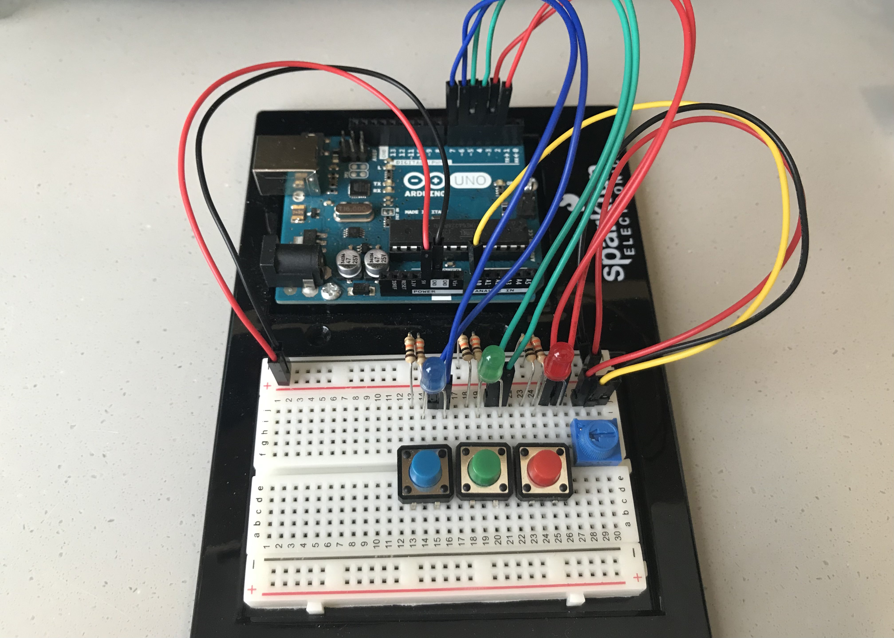

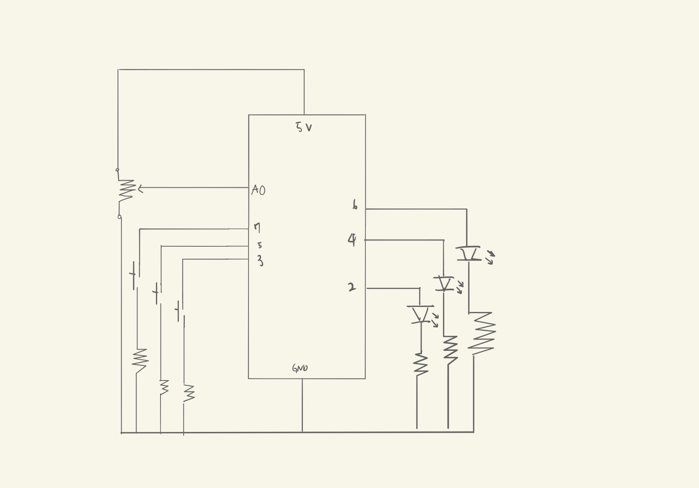

### The Code: Difficulties, Solutions, and Other Cool Stuff

Most of my code is in the journal. If you want to read it (i.e. [me regretting my decision of trying something new for the final](journal.md#day-10), [being hated by Arduino and having it bail on me](journal.md#day-16), [my computer crashing mid-way and deleting everything](journal.md#day-13), etc.), you can always take a look. In addition, here are some topics you can check out in the journal in terms of code:

* [Setting the combinations for the dials so that they can be done like actual combination locks (turning in one direction then the other).](journal.md#day-9)
* [Water cup coding (the ripple effect)](journal.md#day-8)
* [Coding and debugging the Vault Stage (also the day my computer crashed)](journal.md#day-13)
* [The KeyPad class and the numbering system (the conversion from coordinates to digits)](journal.md#day-13)
* [Trying, and giving up on getting Arduino to receive String inputs without lagging](journal.md#day-15)

#### Problem: Three Dials, One Potentiometer

One of the biggest coding difficulties that I came across in my amazing idea to have three dials was the simple question, *how?* I had three buttons, so switching between locks was going to be quite simple; I just needed to assign a value to each one. However, the hard part was the computation of the dial values –– I had only *one* potentiometer.

You see, it's not quite as simple as you might think. Let's say you have dial A whose first value is 94. Dial B, which is up next, has a value of 32. So. Let's say you turn the first dial to 94. What now? If you switch dials from A to B, suddenly dial B is going to be registering a value of 94. We can't have that, especially when there are penalties for overturning the dial. So, in the face of this, I looked through several options.

The first was just making it so that the player needed to go through each dial fully, that is complete the entire lock before moving onto the next one. Not as fun, doesn't use the audio panning as I wanted to, but it was something that I had to compromise given the fact I only had one potentiometer. I *did* consider asking for more, but I liked a challenge. I thought maybe, just *maybe*, I could get it to work. Then I came across the idea of having multiple wires for the analog input.

This was kind of like an "aha" moment for me (this was me working early into the morning, so I was kinda loopy). With this, I could assign one analog slot for one dial. I was so sure it would work. What I *didn't* register, like an idiot (in my defense I was more or less insane at that time), was that just because I had different wires didn't mean that all of a sudden the values were going to be saved. And *that's* when I came across the idea that I implemented: the solution that I came to call the "ghost dial".

#### Solution: The Ghost Dial System

The ghost dial was a dial that the player could move around but wouldn't actually do anything in the game. This was meant to show the player at what position their dial currently was without actually affecting the dials in the process. In order to move the dial that they were on, the player needed to match the ghost dial with the real one. After that, they would be able to move it with the potentiometer (the real dial). I'm not really sure where I got this idea from. I know that it had to do with me thinking of saved states in games, but I feel like there was something other than that which gave me this idea... In any case, this system was implemented using a set of boolean values for selection by the player and activation of the dial. Here's the code for the update (shortened to only include things related to the ghost dial system), which dictates half of the system:

    //Update
    void update(int potPosition) {
    
    .
    .
    .
      if (!isSelected) {
        isActive = false;
      }
      //while locked, player can move dial
      if (!isUnlocked) {
        //if dial has been selected (when you press a different button it deselects)
        if (isSelected) {
          //if the lock is not active (player is returning to lock), cannot proceed with updates until
          //potPosPast is the same as what the current pot value is (until player matches ghost dial with real dial)
          //must be the correct lock in order to activate.
          if (!isActive) {
            if (lockDigit == lockDigitPast) {
              isActive = true;
            }
          }
          //if lock is active, then values begin to update (with the real dial moving)
          else {

            //for the case that a spike value appears (more than +-5 the past value), the value is ignored.
            //if lock is fresh, must start at 0. otherwise, the value must be within range of error (+-5)
            //this doubles as a restrictor that keeps the player from turning the dial too quickly and makes the stage
            //take longer to complete.
            if ((potPosPast - 10 <= potPosition && potPosition <= potPosPast + 10)) {
            
            .
            .
            .
            
              //if the lock digit is assigned and correct, then the lock will move on to the next digit.
              (else) if (isAssigned && lock.checkInput(lockDigit)) {
                if	(isAssigned && !lock.checkLock()) {
                  lock.iter++;
                }
                isMatched = true;
                //water ripples
                waterCup.isRippling = true;
                //upon matching the digit, the dial checks if the entire passcode has been matched
                if (lock.checkLock()) {
                  isUnlocked = true;
                }
              }
              //update value of last digit and potPosPast
              lockDigitPast = lockDigit;
              potPosPast = potPosition;
            } else {
              isActive = false;
            }
          }
        }
      }
    }

Here, you can see that when the player selects a dial with the buttons, the dial's actual value doesn't change (lockDigitPast is not updated) and the dial is not activated until the player reaches the saved state of the dial (the last digit they were on when they changed). This ghost dial is invisible, in theory, until you have the display function:

    //Display
      void display() {
        rectMode(CENTER);
        imageMode(CENTER);
        stroke(0);

        fill(150);
        rect(locX, locY, imgWidth + 10, imgHeight + 30);

        //triangle over dial
        if (isUnlocked) {
          fill(0, 255, 0);
        } else {
          fill(255, 0, 0);
        }
        triangle(locX, locY - imgHeight/2 - 3, locX + 10, locY - imgHeight/2 -10, locX - 10, locY - imgHeight/2 -10);
        fill(0);

        //display real dial (using lockDigitPast)
        pushMatrix();
        float rotationReal = map(lockDigitPast, 0, totalDigits, 360, 3.64);
        translate(locX, locY);
        //println(rotationReal);
        rotate(radians(rotationReal));
        image(vaultDialImg, 0, 0, imgWidth, imgHeight);
        popMatrix();

        if (isSelected) {
          //if inactive (lockDigit != lockDigitPast)
          if (!isActive) {
            //display ghost dial (using lockDigit)
            pushMatrix();
            float rotationGhost = map(lockDigit, 0, totalDigits, 360, 0);
            translate(locX, locY);
            rotate(radians(rotationGhost));
            //lower opacity of image before displaying
            tint(255, 120);
            image(vaultDialImg, 0, 0, imgWidth, imgHeight);
            popMatrix();
            noTint();
          }

          //display water cup
          waterCup.display();
        }
      }

As you can see, the ghost dial follows the values of lockDigit–– that is, it follows the current value of the player's input through the potentiometer. The actual dial, on the other hand, follows the value of lockDigitPast, which is not updated until lockDigit == lockDigitPast. In this way, it allows the player to switch between dials without messing up any values on them. I don't know about you, but I thought that this was pretty cool.

#### In-Between: AutoCracker, the code that kinda (sorta) works but is still cool regardless

Something fun I made to test the validity of the locks was a special lil' thing called AutoCracker. It was basically a function made to crack the dials that I implemented. It worked on individual dials, where all you needed was to go back and forth along values, but it stopped working as efficiently once I implemented the ghost dial system and added two more dials to the mix. In any case, here it is:

    //AutoCracker (tester)
    void autoCrack() {
      print(lockDigitPast + ":" +num);
      println(num);

      isSelected = true;

      //while inactive, gets to the right number to activate lock
      if (!isActive && lockDigit != lockDigitPast) {
        if (lockDigit > lockDigitPast) {
          num--;
        } else if (lockDigit < lockDigitPast) {
          num++;
        }
      }
      //once active, solves for digit
      else if (isActive && lock.iter < dialLength) {
        if (lockDigit != lock.passcode.get(lock.iter)) {
          if (lock.iter % 2 == 0) {
            num++;
          } else {
            num--;
          }
        } else {
          println("match : " + lockDigit + " iter : " + lock.iter);
        }
      }
    }
    
Basically, there's a global variable called num that is initially set as 0, and the AutoCracker will begin the cracking as soon as it's called. It moves extremely quickly, finishing 10 digits in less than 10 seconds. It's really fun to watch it go, too.

#### Another Cool Idea: The Keypad, from Coordinates to Digits

Something that I came up with maybe halfway through the project was the idea of using the light game project I made a while back to create a system that could create a passcode you needed to enter. This was the Matrix System. It's also in the journal with a bit more commentary, but here it is now (once again, just a part of it):

        (constructor)
        .
        .
        .
        //make the matrix of 1-9 (3x3)
        int num = 1;
        for (int i = 0; i < 3; i++) {
          ArrayList<Integer> temp = new ArrayList<Integer>();
          numMatrix.add(temp);
          for (int j = 0; j < 3; j ++) {
            numMatrix.get(i).add(num);
            num++;
          }
        }
      }

      //Get passcoords with Serial Input
      void getPassCoords(int[] inputs) {
        //println("clearing");
        passcodeCoords.clear();
        //populates the passcodecoords array with input from Serial
        for (int i : inputs) {
          passcodeCoords.add(i);
        }
      }

      void createPasscode() {
        //creates passcode using the pairs of numbers (increments by 2)
        int j = 0;
        int i = 0;
        while (i <= 15) {
          int row = passcodeCoords.get(i);
          i++;
          int col = passcodeCoords.get(i);
          i++;
          int digit = numMatrix.get(row).get(col);
          lock.passcode.set(j, digit);
          j++;
          if (j == passcodeLen) {
            break;
          }
        }
      }
      
This code works hand in hand with the Arduino, which uses the random() function to populate an array of size 16 (I made it 18 just in case of an overflow; kinda very paranoid about array stuff because of null exception trauma) then send those values over to Processing, which converts it into digits by using 2D arrays. Cool stuff, but it's not as ingenius as the ghost dial system (I am never going to let that one go).

#### While We're Talking About Cool Things, Audio Panning

Had this idea from the start. Make the player only have *one* water cup so they can't work on all the dials at once. It was something that was supposed to be really fun (and it was), but coding it was a sucky time for me (as you've probably heard me say over and over). Regardless, this idea of using audio panning was something that came up while I was trying to come up with an idea of how to get the player to know which dial to use. This is the code that I used to make this audio panning work:

      //Dial Assign (Program)
      void dialAssign() {
        unassignAll();
        int choice = 0;
        //select a random dial as long as it is not unlocked and there are locked dials remaining
        choice = (int)random(0, 3);
        if (checkCompleteAll()) {
          //play sound of unlock complete
          muteSounds(vaultDialSounds);
          dialClack.play();
          dialClack.amp(1);
          dialClack.pan(0);
          //set as stage complete
          isComplete = true;
        } else {
          while (dials.get(choice).isUnlocked == true) {
            choice = (int)random(0, 3);
          }
          assignedDial = choice;

          //assign dial
          dials.get(assignedDial).isAssigned = true;

          //make sound; pan according to which dial it is
          if (dialTick.isPlaying()) {
            dialTick.stop();
          }
          dialClick.play();
          dialClick.amp(1);
          dialClick.pan(assignedDial-1.0);
        }
      }

As you can see, at the end, the newly assigned dial's number is used in order to get the pan() to work. I thought it was pretty smart of me to do that, instead of having to make a bunch of if statements. In any case, that's how it works. I had a *lot* of work getting to this point, which you can read more about [here](journal.md#day-14).

#### The Problem Never Solved: Arduino Hates Me.

This one problem, pretty major I guess, is what kept me from expanding the project further than the size that I made it. Initially, I was going to allow the player to practice on a dial and a keypad before they chose to depart on the actual heist in the instructions page. However, this is where Arduino stepped in and kicked me in the stomach (or.. did I?). Basically, it stopped responding. Like the loop stopped. It stopped updating, it stopped taking my .writes(), the TX and RX lights turned off and Arduino Uno became a bunch of wires that were unresponsive. I never got that fixed completely. Sometimes it works, other times it doesn't. The moment I try to add more stages and more if statements in Arduino, it kind of bails on me. It's really weird, but I'm thankful that it at least lets me do these two stages. It's really weird because they all work great individually, but when they're put together they break down and die. I dunno. In any case, this is one of the main reasons why I decided not to pursue any more stages; I didn't really have the time, so why try to make more stages when I wasn't sure if Arduino was going to let me? Regardless, the game turned out okay, so I'm not angry. Just kinda disappointed.

### A Moment to Remember the Loss of Ideas that Never Came to Be...

I'd like to acknowledge all of the ideas that never were implemented, all of the ones that got away.

* The VN-style story, with all the characters and dialogue. I'm sorry I didn't have the time to write a script, and I'm sorry for leaving all of you assets in the deepest, darkest part of my project folder.
* The drill stage. You were supposed to be the first stage of the game. You really were. That's where all the wires from the keypad stage come from. The player drills those holes and puts the wires there. I'm sorry I didn't get to you; debugging took a lot of time and I just couldn't put you in the game.
* The interactive instructions. Things weren't as easy as midterm because Arduino was involved this time. I'm sorry. You guys work fine on your own, but when Arduino comes in it screws you over and bails on you. I had to have you sit out of this one. Maybe next time?
* The final stage of the game, the money-grab stage. This was what was supposed to decide the score of the game; various stacks on money in the vault, each one with a certain amount of alloted points and time to retrieve. Alas, I a) did not have the assets and had no time to make them from scratch and b) realized that it would take a *lot* of coding to bring you all into existence. I'm sorry. I just didn't have the time or the skills. You will be missed.

And to the others, that appeared for the briefest moment in the corner of my mind before slipping away, I also apologize. I just didn't have the time. I had three presentations and two papers due, as well as an exam. Things got tough and I spent three days and nights up working on everything–– but I couldn't make you a reality. You will be missed. Sort of.

### All Good Things Come to an End...

So, concluding remarks. I got the assets (dial image and sounds) from the internet (googled it, first link that popped up; you get the picture). The game theme was Money Heist, a Netflix show that's based around bank heists. It's pretty good.

And that's about it. Thanks for a great semester. Hope to see you again. Cheers.

––Joseph, at the end of 2020
