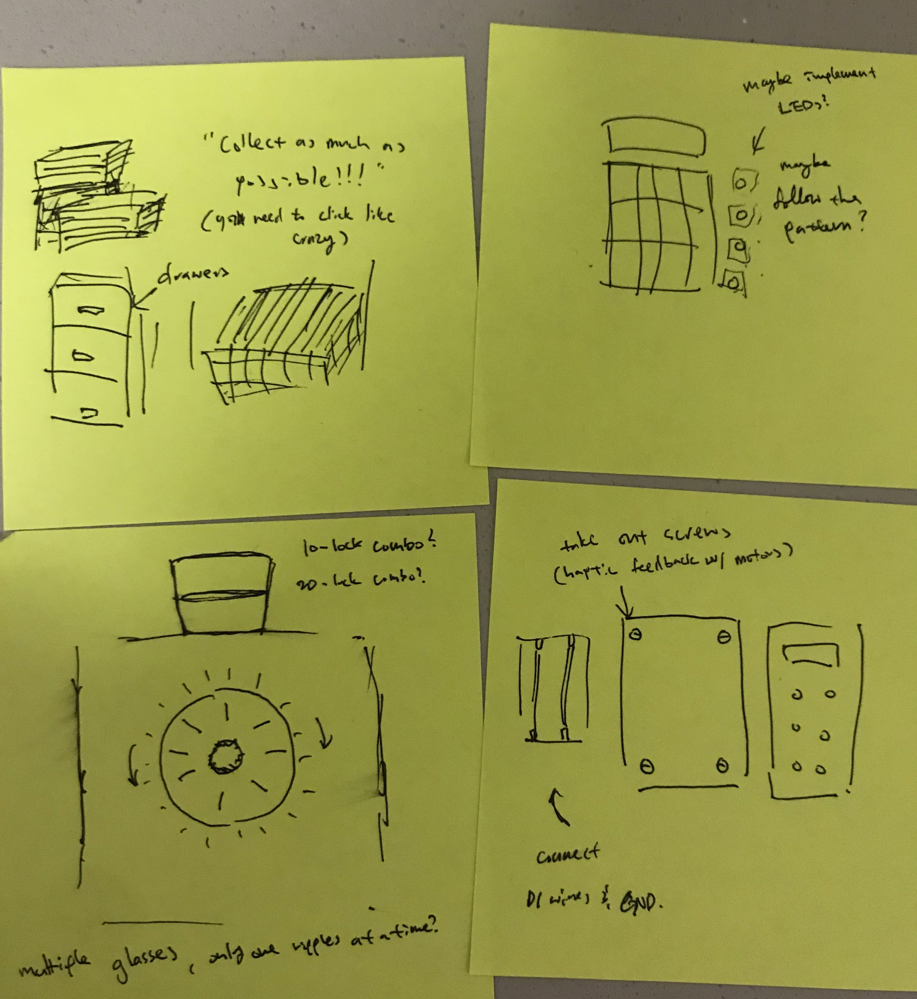
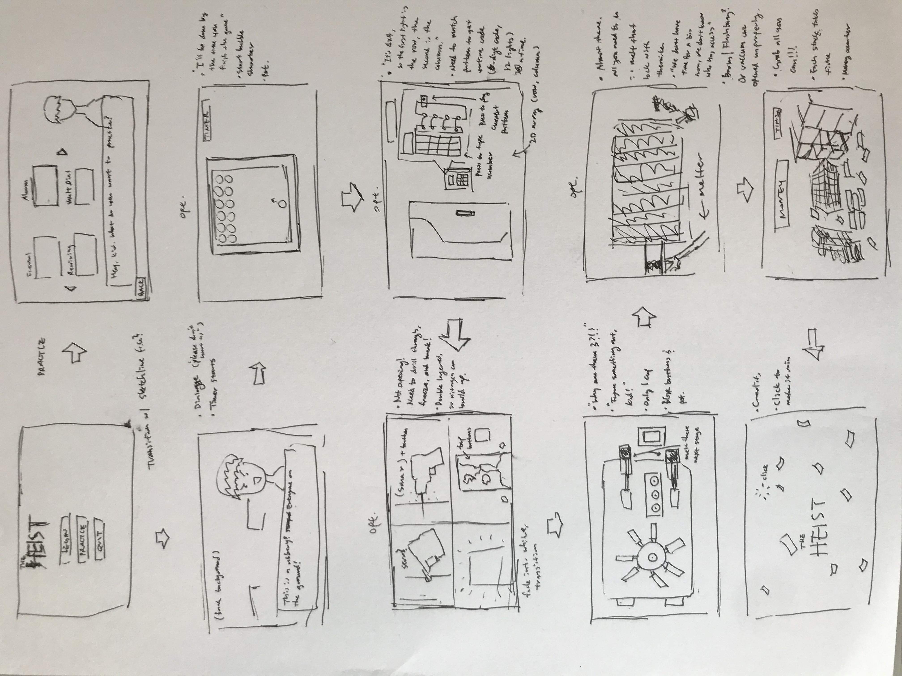

### The Journ(ey)al

[Day 1](journal.md#day-1); [Day 2](journal.md#day-2); [Day 3](journal.md#day-3); [Day 4](journal.md#day-4); [Day 5](journal.md#day-5); [Day 6](journal.md#day-6); [Day 7](journal.md#day-7); [Day 8](journal.md#day-8); [Day 9](journal.md#day-9); [Day 10](journal.md#day-10); [Day 11](journal.md#day-11); [Day 12](journal.md#day-12); [Day 13](journal.md#day-13); [Day 14](journal.md#day-14); [Day 15](journal.md#day-15); [Day 16](journal.md#day-16)

#### Day 1 (11/11)

I'm thinking of trying to make a game similar to the Tap Tap series (which for some reason doesn't exist anymore on the App Store), where you tap on incoming "beats" (orbs) that come down the screen according to the beat of the song. This used to be one of my favorite pastimes, but now it's gone (replaced by others, which are fun, but just don't have that same nostalgia. I realize now that the Tap Tap games may have been removed due to infringing rights for privately-owned music, but I won't let that taint my memories of the game).

I think I'll have to use buttons on the arduino, since I don't have enough photoresistors to imitate the "touch" or just actual touch sensors. I have no idea how I'll program the orb sequences (I may have to hardcode this data, using a CSV file or something) but I'm thinking of making a scoring system based on how close to the center of the orb you are when you press the button (I realize that there might be delays between the arduino and program but that's something I'll figure out later).

What I know I'll need is a start page (instructions & stuff), a music selection page, and the actual game screen. I'll also need to use a sound file library and find a way to handle the rhythm bit (if I can make it automatically, that'd be even better). This time, I'll figure out how to make those separate files and use them so it's easier to read for others (in my defense, I used Sublime so I just collapsed everything I didn't need).

Why am I starting so early? There are a *lot* of things that are coming up soon, so I thought it best to get things done faster. I remember how ~~terrible-and-sleep-depriving-to-the-point-of-breakdowns~~ exhausting it was because all my assignments and midterms were in the same week, and I don't want to go through that again. However, I have a bunch of stuff due this week so I may not get back to this until next week.

#### Day 2 (11/20)

So, some mistakes were made and I didn't realize that we had another assignment on top of the musical instrument one. I had to work on that, so I didn't do much in terms of the final project. Right now, I'm really wondering what I should do. Should I continue with this idea? If so, I have a general gist of how I want to do the project, in terms of the menu and the game. However, it seems kind of... boring. Yes, it's cool and all, but for some reason it doesn't feel all that innovative. Yeah, it's a knockoff game, but right now that's just about all I can do. Thinking of making the menu as a bubble shooter kind of thing but... Whoa. I think I may have lost motivation for this game. That was fast. I'm going to think of new ideas and get back to this.

#### Day 3 (11/22)

I said it jokingly in my assignment, but what if I actually made an escape room or something? Like have a breadboard of random sensors and things, then use each of those? It's fun, and it won't be a knockoff of anything. The question, however, is how to randomize something like that. I know it's kind of going overboard, but I want to think about things like that as well. In the case that I don't randomize it, that means that I need to implement some kind of feature that'll make it exciting. Maybe a timer.

#### Day 4 (11/24)

Speaking of timers... Not a lot of time left until I need to start working on the project for **sure**. I don't want things to turn out like last time, so I need to pick an idea and stick to it. I'm not doing Tap Tap, I might do an escape room, and I have an idea for one of the things. It's a vault where you place a cup of water on top of the dial to see if there's a click. Really cool, saw it on a TV show. Want to implement that. Also, what the prof said about using the same sensor or switch for multiple functions made me think about how I might be able to use the same things for different purposes...

#### Day 5 (11/26)

A bank heist. That's what I can make. Thought of it just now, as everything clicked together. It's fun, new, and innovative. I can also add a timer so that people need to move fast (and hopefully miss out on any bugs that might exist hehe). The question now is what features there should be and how I can make it work. Last time, all I needed was one button. But this time, I'm thinking of using almost all of the sensors that I have. This is gonna be a tough one. Will I have enough time? If not, I can just stick with the vault by itself (meaning I'll work on that first, then go to the others if I have time). Yeah, it works. Eskettit (let's get it).

#### Day 6 (11/28)

Thought of some new stage possibilities, as well as a sort-of storyline. Thinking of making the game something of a VN (virtual novel; these are common in Japan and are basically stories where you choose your path) with characters and narrations. Maybe for the instruction section, it can be like a heist rehersal where you learn the basics of all the sensors and how to use them. The game itself will be a lot harder, of course, so the instruction will be more of a tutorial. I think I'll call it "Rehersal" instead of "Instructions" to make it seem more realistic (haha). This section will allow the player to get used to the various sensors in the game. In addition, I think I'll make the game a sort of DIY breadboard. This will make it harder for the player (they need to select the right tool and place it in the right place), and it'll also save space on the board for me (hehe).

Started on the basic classes, but ran into issues right away regarding how I'm going to be categorizing these things. I think I might have a separate class called "Lock" and "Stage". Locks will consist of an array of integers (the code, which can be assigned using the random function; the parameters of the function will be set in the constructor, as well as the number of digits in the passcode) and have a method of checking a specific index with a number. Getting it wrong will reset the stage (or end the game, depending on the stage itself). Stages will have locks and other information, depending on what tool (sensor) is needed.

#### Day 7 (11/30)

Drew out a storyboard of sorts for a guide for me to use. This actually took a lot longer than I expected, as I needed to come up with ideas and think of what sensors or parts of the breadboard I could use.

As you can probably see, I marked almost all of the stages as optional. The reason behind this is because I actually started the coding process for locks, dials, and water cups. With the time that I have, and the work that I need to complete aside from IM, I need to think realistically. I plan on finishing the vault stage first, then see how much time I have before implementing everything else. Thinking about how I'm making this into a VN of sorts means that there's another layer of added complexity with character dialogues and looking for images that I can use (I think I know what I'll use, though; I have assets from a mobile game called SAO Memory Defrag, planning on using the toughest looking guys there).

The Lock class is a bit more complicated than I thought, especially when it comes to the dial locks. They're combinations, but the thing is that because the potentiometer isn't a free-spin sensor, I need to code it so that whenever a digit is matched, the player needs to turn the potentiometer in the opposite direction in order to get to the next number. This is the code:

          //set initial value (first digit)
          int val1 = (int)random(startNum,endNum);
          passcode.add(startVal);
          //when a value is selected, this becomes the endpoint value for the next number
          //this forces a player to turn right, then left, then right... (like a lock dial)
          for (int i = 0; i < length-1; i += 2) {
            int val2 = (int)random(startNum,val1);
            passcode.add(val2);
            val1 = (int)random(val2,endNum);
            passcode.add(val3);
          }

I don't know if I can refine this further, but what I need to do now is either ensure that the passcode of the dial locks will always be odd in length or use the .remove() function to match the size of the array to the length of the passcode.

#### Day 8 (12/1)

Finished the water cup coding. It was actually rather simple, and it's kind of addicting to play with. I'm talking about how it ripples. It uses an arc whose height increases but only has half of it drawn, giving the illusion that the surface of the water is dipping down. Here's the code:

        //Ripple effect (just a dip in the water, nothing complicated)
        void ripple(){
            if(frameCounter <= 5){
                rippleDepth = frameCounter;
            }
            else if(frameCounter > 5){
                rippleDepth = 10 - frameCounter;
            }
            arc(locX, locY, 110, rippleDepth, 0, PI);
            frameCounter++;
            if(frameCounter >= 10){
              frameCounter = 0;
                isRippling = false;
            }
        }

    //Display
    void display(){
        //base of cup
        line(locX - 50, locY + 50, locX + 50, locY + 50);
        //sides
        line(locX - 50, locY + 50, locX - 60, locY - 50);
        line(locX + 50, locY + 50, locX + 60, locY -50);
        //water
        if(!isRippling){
            noFill();
            line(locX - 55, locY, locX + 55, locY);
        }
        else{
            ripple();
        }
    }

I linked the rippling to a mouse click and spent a few minutes clicking. It's rather addicting and soothing. In any case, I didn't actually finish the Lock class because I'm not really sure what I need in terms of data members. I started on the Dial class, but I also hit a sort-of wall thinking about the methods that I need for the class–– especially because I'm trying to make the lock reset if the player overturns (turns too much past) the digit. I'm thinking of making them have to reset by turning the dial to 0 again and then starting over. I remember how the potentiometer sometimes gives random values, so I need to make sure that a jump will not be counted as an overturn. Maybe I'll use a function that checks how far away from the previous value the current value is. Since it's unlikely that someone will be able to turn the potentiometer fast enough (or will *want* to; remember that this is a vault dial), if I make sure it's within 10-20 of the past value it should be enough, since I'm going to divide the potentiometer into 100 numbers (divide by 100 so that every 10 values is one number and the last is 14 in size). I also need to make the dial *spin*, so that means I'll have to use the rotation() function, too. Wow, this thing just keeps on getting more and more complicated. Well, off to work.

#### Day 9 (12/2)

Okay, so I looked over the Lock coding for the dial and realized I could make the system work by checking whether i is even or not; if it's even, that means that I perform the (int)random(startNum,val1), but make it so that val1 is actually a reference that points to the index before i (so basically using .get(i-1) ). This means that i will start at 1 rather than 0. This is the result:

                for (int i = 1; i < length; i++) {
                    int temp;
                    //if i is odd, (int)random(startNum,passcode.get(i-1))
                    if(i%2 == 1){
                        temp = (int)random(startNum,passcode.get(i-1));
                        passcode.add(temp);
                    }
                    //if i is even, (int)random(val2,endNum)
                    else if(i%2 == 0){
                        temp = (int)random(passcode.get(i-1),endNum);
                        passcode.add(temp);
                    }
                }

While making the circuit (still haven't actually decided how to do that either), I ended up removing a button so I'm only using 3. Makes the game easier, but also leaves room for more wires. What I'm worried about is the analog. I've created a sort-of workaround by making it so the player needs to plug in the right wire before starting the stage. This may be quite complicated, but it's fun to do nonetheless. Will work more tomorrow; I had an assignment due today so I worked on that most of the day.

#### Day 10 (12/4)

I've mostly been focused on assignments from other classes because they're more imminent (as in they've been due every day and I'll have an assignment due every day from today onwards), but I've also been thinking about how I can make the game work in the process. I also worked on the dial, thinking about how I could make the potentiometer value work as the dial for the combination lock. What I came up with was a system that basically checks the value of the potPosition and compares it to the digit in the passcode. This, however, only works when the potentiometer value isn't fluctuating wildly; this is supposed to prevent the random surges in values from messing up the process. I'm not fully sure if it'll work or not, but this is the code. I haven't gotten to adding sound files, so those lines of code are empty.

    void update(int potPosition) {
          //for the case that a spike value appears (more than +-10 the past value), the value is ignored
          if ((lock.isFresh && potPosition == 0) || 
                    (potPositionPast - 10 <= potPosition && potPosition <= potPositionPast + 10)) {
                    //if the lock digit is correct, then the lock will move on to the next digit automatically.
                    if (lock.checkInput(potPosition)) {
                              //make sound
                              //dialClick.play();
                              //upon matching the digit, the dial checks if the entire passcode has been matched
                              if (checkLock()) {
                                        //make fully unlocked sound and set isUnlocked as true
                                        //dialUnlock.play();
                                        isUnlocked = true;
                              }
                    }
          }

There's obviously a lot more work to be done, and I'm starting to think that I might only be able to get the dial done for the game, along with the story. At this point I don't have any clue as to whether I'm going to be making my own assets for the bank and vault (I might have to), but in the case that I do that means I'll have even less time to get the code to work.

I also worked on the serialEvent, but I'm wondering what kind of communication the program and Arduino should be having. Should it be the stage, any values that need to be added, then whether the stage is complete? What will the Arudino send back? Which values, and how? These are just some of the issues that I'm running into. Maybe I should've stuck with a game that I knew how to make. This is unexplored space for me and I don't think that was a great idea with all the work that I have. Wait, why do I get a feeling of *deja vu*? Ah, right. This exact thing pretty much happened with my midterm project. Why do I do this to myself?

#### Day 11 (12/5)

So funny thing. I realized that my logic behind having multiple analog wires was kind of flawed. I didn't think about how values would fluctuate when they were left out, so I might have to keep the wires in at all times and cut the count to one wire for the dials, using the buttons to change between locks.

I also got an idea regarding how I can achieve what I want, which is having the player alternate between locks with ever single number. I had given up on the idea and was going to make it so you needed to complete one lock at a time, but I realized I could use something similar to a save state for each lock. Each time a lock is called, it is activated. Once the player reaches the saved number (that is, the digit that was matched correctly before the switch in dials was called), then the dial begins moving along with the potentiometer. I think I can have to dials, one overlapping the other using a lower opactity, to show the player's current potentiometer position. This makes it challenging because the player needs to keep track of which direction they were turning the dial in because one you're at the number, you need to turn it in the opposite direction.

This is super complicated, but if I'm cutting down on content I should at least make the remaining content better... right? I still don't actually know about what I can do for the story, though...

#### Day 12 (12/6)

In the process of implementing the ghost dial system (whoa that actually sounds k i n d a   c o o l ). I'm teetering between using the potPast value or just creating a new variable called lockDigitPast that stores the actual *digit* of the last number, rather than the potentiometer value for it. Also, I decided to use the map() function instead of using the system that I had with dividing the potentiometer value with the segment size in order to get the dial digit. I don't understand how I didn't actually see that until just recently... Anyway, I also started on the display function for the dials, making it so that the real dial will always be displayed (updated using the variable lockDigitPast) and the ghost dial will be over the real one (need to find how to make images translucent again; I think it was by adding a fifth value but I'll have to double check.

Also, something that struck me while I was struggling to come up with the finer details of the dials today was that if I spent that time working on something else–– that is, more features ––I might be able to use my time more efficiently. Not that much help considering I realized this two days before the due date, but I think I might try it tomorrow. Taking a break from this code and working on something else will hopefully give me more ideas to work with.

#### Day 13 (12/7)

So... my computer crashed yesterday. All the stuff that I wrote for then and everything I worked on was wiped out without a trace. I should've committed. I've been writing up for days at a time and uploading all at once, but this.. *fun* experience has taught me a) my computer is failing so I need to buy a new one and b) I need to regularly update by repository so that everything is stored online.

Okay, so what *did* I do today? Well, a *lot*. I started the debugging and it took me a good ol' 12 hours to finally get the stupid thing to work. First off, I made a method in the dial class called autoCrack. As the name implies, it's meant to automatically crack the dials. This works well when there's one lock, but not as much when there are multiple alternating between each other. Here's the code for it:

            //AutoCracker (tester)
            void autoCrack() {
              //print(lockDigitPast + ":" +num);
              println(num);

              isSelected = true;

              //while inactive, gets to the right number to activate lock
              if (!isActive && lockDigit != lockDigitPast) {
                if (lockDigit > lockDigitPast) {
                  num--;
                } else if (lockDigit < lockDigitPast) {
                  num++;
                }
              }
              //once active, solves for digit
              else if (isActive && lock.iter < 10) {
                if (lockDigit != lock.passcode.get(lock.iter)) {
                  if (lock.iter % 2 == 0) {
                    num++;
                  } else {
                    num--;
                  }
                } else {
                  println("match : " + lockDigit + " iter : " + lock.iter);
                }
              }
            }

This, when I'm running it on the vault stage, is meant to go hand in hand with the autoSelect() function, which automatically selects whichever dial is assigned and performs the crack on it. I've had a bit of trouble getting it to work properly, but it did (for a while anyway) and it was enough, since I'm not trying to make the game automated.

After that was getting the Arduino and Processing to communicate. I decided to start with the buttons and potentiometer, so that I select which dial to select and turn the dial. **It was a nightmare**. I spent hours trying to get the thing to work because it wouldn't. Read. The. Serial. Properly. I looked up everything I could find and still failed. Hours and hours of work went into trying to make the two things communicate (and a lot of screaming and punching in frustration) before I defaulted to using one of the Arduino examples online (and that worked, which didn't make sense because that was *exactly* what I'd been doing. Anyway, I have a gist of how the communication works now, so once I clean up the dial stage I can start working on the others. I think I might save the story for last, because that's technically one of the least important features in the game. But whether or not I'll actually be able to get the stages done, well, that's a different story. I thought that I'd be finished with debugging the stage in three, maybe four hours, tops. Instead I spent the entire day (and I mean the *entire* day) trying to get the stage to work properly. The communication bit was the most frustrating and the alternation between dials took the longest.

Speaking of that, here's the code that alternates between locks when they're completed.

            //Dial Select (Player)
            void dialSelect(int buttonPressed) {
              deselectAll();
              selectedDial = buttonPressed;
              dials.get(buttonPressed).isSelected = true;
            }

            //Dial Assign (Program)
            void dialAssign() {
              unassignAll();
              int choice = 0;
              //select a random dial as long as it is not unlocked (choose from remaining dials)
              choice = (int)random(0, 3);
              while (dials.get(choice).isUnlocked == true) {
                choice = (int)random(0, 3);
              }
              println("assinging " + choice);
              assignedDial = choice;

              //make sound; pan according to which dial it is to hint which is the next
              if(dialTick.isPlaying()){
                dialTick.stop();
              }
              dialClick.play();
              dialClick.amp(1);
              dialClick.pan(assignedDial-1.0);

              //assign dial
              dials.get(assignedDial).isAssigned = true;

            }

            //Deselect All Dials
            void deselectAll() {
              for (Dial d : dials) {
                d.isSelected = false;
              }
            }

            //Unassign All Dials
            void unassignAll() {
              for (Dial d : dials) {
                d.isAssigned = false;
              }
            }
            
There are two parts to this code, the unassignAll() and the dialAssign(). Basically, the dials have a lot of boolean values that indicate whether they're assigned (the right one to work on), selected (player is actually working on them), and active (the dial is being turned). The dialAssign() is what sets a dial as assigned by the program, while the dialSelect() is what sets the dial as selected by the player. This method allows the player to interact with the program and learn what to do vs what not to do.

Oh! Something fun! I added the timer feature, like I said I would, but I also realized that I could do something with that. Normally, when the player messed up I would have the game end automatically and have the cops come in, but I thought there was something unfair about that. So, I decided that whenever the player is doing something wrong, the timer will speed up. Once the remaining time reaches 0, that's when the cops will come in. I'm thinking 5 minutes for now, but I might make it 7 or 10 depending on how long it takes for me to finish the actual game. The timer is set at the beginning as milliseconds (300,000 for 5 minutes) and is updated in the draw() section:

            int passedTime = millis();
            int subtract = passedTime - savedTime;
            timeRemaining -= subtract;
            savedTime = passedTime;

The savedTime variable is the millis() at the start of the program, but it's constantly updated throughout the game so that it acts as the timer. Anyway, what happens is that each time the player makes a mistake, the reduceTime() function is called. It's very cut and dry, performing remainingTime -= 100. I might increase or decrease this amount depending on how hard this is (or might make it a difficulty option...?).

Oh, another thing I added was the pan() function for the ticking of the dials. This is meant to help the player differentiate what dial is assigned–– which means headphones are supported (if not recommended). It was quite the experience, maybe 2 hours trying to get the audio to work properly. At one point I gave up on Sound and tried converting to Minim, but realized that I had no idea how to use Minim so went back to Sound. Life is fun. Also, make sure you don't use any headphones that support noise cancelling. You have no idea how long I thought the pan() was broken before realizing that the Processing automatically sets the device into input mode, which is why any sounds made come from both sides. Using OG, old earbuds work, though. Also, had a bit of trouble trying to get the audio files into MONO. Had to download a whole other application and split the audio. Fun times.

There's a lot, and I mean a *lot* more stuff that I did, but I'm kinda tired of writing stuff I wrote THAT GOT DELETED all over again. So, onto today.

#### Day 14 (12/8)

Today, I'm going to make sure that this vault stage works, then start working on the drill & doorlock stages. The idea is to use the sonar to move the drill and make a fun little game where you need to memorize a pattern and use it to write out a keycode. I'm going to make life as miserable for the player as this program made mine. Call it empathy.

So... the vault stage isn't working as smoothly as I wanted. Need to work on it. The pan() is sometimes coming from both ears when playing the sound for the next dial, which is not good because it's supposed to be the indicator for the next dial. I don't know what's wrong, and there isn't much about panning on the internet–– at least not about Processing, anyway. So. Looks like I'm going to be messing around till this works... In the meantime I'll also try to get the Arduino to read multiple inputs (err strings) as well.

Fixed the pan() issue; it was actually because I had added another block of code that had a pan() of the current dial (not the next one) and this was causing the audio to play from both ears. Now I'm trying to keep the program from bailing on me when the dials are completed. The update just stops and I can't end the stage. Have to fix that.

HA! I FOUND IT! (at least I think i did)

Okay. So remember how I had that code for dialAssign()? Well, if you look closely, there's a while loop.

          while (dials.get(choice).isUnlocked == true) {
                choice = (int)random(0, 3);
              }

What the problem was that, once all of the dials have been completed, it falls into an infinite loop. That's why the program was seemingly bailing on me. It's not that it hates me, which is a relief :) This function was in front of the checker, which was what the problem was. I'm going move the checker *into* the assign function. Here it is now:

            //Dial Assign (Program)
            void dialAssign() {
              unassignAll();
              int choice = 0;
              //select a random dial as long as it is not unlocked and there are locked dials remaining
              choice = (int)random(0, 3);
              if(checkCompleteAll()){
                //play sound of unlock complete
                muteSounds(vaultDialSounds);
                dialClack.play();
                dialClack.amp(1);
                dialClack.pan(0);
                
                //set as stage complete
                isComplete = true;
              }
              else{
              while (dials.get(choice).isUnlocked == true) {
                choice = (int)random(0, 3);
              }
              println("assinging " + choice);
              assignedDial = choice;

              //assign dial
              dials.get(assignedDial).isAssigned = true;

              //make sound; pan according to which dial it is
              if (dialTick.isPlaying()) {
                dialTick.stop();
              }
              dialClick.play();
              dialClick.amp(1);
              dialClick.pan(choice-1.0);
              }
            }

#### Day 15 (12/9)

Worked more on the communication side of the project and came across an unexpected problem: my computer can't handle everything going on at once. I don't want lag. That kills the experience. I think this is kind of forcing me to cut down the game to just the vault dials. I can add a separate stage for the keypad on the door lock, but I don't think I can put them in the same file or else the lag will get too bad. Also, something cool is the way that I got the Arudino to take String inputs from Serial.

    char readData[10] = "0000000000";
    // get incoming byte:
    inByte = Serial.readBytesUntil('\n', readData, 10);

    //change the received information into a string
    String input = "";
    int index = 0;
    while (readData[index] != '0') {
      input += readData[index];
      index++;
    }

This is the exerpt. Bascially, I used the readBytesUntil() in order to add all of the characters into an array, then made it into a string. This was so that I could have multiple types of stages, but seeing how things are with my computer crashing twice and lagging real bad (the fan is lifting off too), I don't know if I'll be able to do it.

But I've done a lot of things since yesterday. I started the keypad stage, where you need to find the right combination for a lock on a door. This would be through a form of a light game where you need to match the patterns. Here, the lights would indicate rows and columns which correspond to what's on the screen (a 9-digit keypad). You press the buttons and submit, and if it's right the door opens! This is really cool so I'm going to try to finish this, even if I can't put the two stages together because ~~my computer sucks~~ there's too much lag and that kills the experience.

So, while trying to figure out the cause of the problem, I learned that it was actually my ingenious string input creater on Arduino that was causing the issues. It was because of the readBytesUntil() function. Apparently that was what was causing the delay between Arduino and Processing. Which means... I don't actually know what that means. I'm not sure how the programs are going to communicate more than a single stage if this is what's happening.

Update: I come bearing good news. I can do more stages (if I can code them in time). Basically, I had a problem where no matter what I did for making different stages on Arduino, it would only return the values of the first block of instructions. I found out that the problem was in my if statement. I made the stupidest mistake ever. I did "=" instead of "==". I just wasted a full hour and a half trying to make a code work when it was already working from the start. What am I doing with my life?

I uploaded what I have so far because I don't want to go through the whole crash-and-everything-gets-deleted thing again.

So... I messed something up and now nothing works anymore. It sucks because everything was working just fine. Now my Arduino just shuts off when I try to connect it. Dunno if it's because I'm trying to make it do too much work but it's really frustrating.

#### Day 16 (12/10)

Alright, so a lot happened in between yesterday and today, so I decided to just write it all down so I wouldn't forget. So, first off, those practice stages didn't work because Arduino doesn't like me. It's really weird because it works when there are two stages but any more than that and it bails on me. I've been looking around on why this is happening, and as far as I can tell it's not an error on Processing, since it keeps displaying what it needs to. All that happens is Arduino stops its loop(); the TX and RX lights turn off. It doesn't even send any bits to Processing. It just dies on the spot.

Because of that, I ended up having to just write out the instructions. Also, I didn't finish the drill stage because I spent so much time trying to debug the program. In a sense, the game still works so that's alright. I just left some of the code inside of the files just in case I want to come back to this later on (I probably will). In any case, I finished the KeyPad class, which was a stage in itself that consisted of a Lock and multiple Keys. I decided to create individual objects for the keys of the keypad because it was a lot easier if I just went through all of them in a loop, rather than trying to calculate the location of each and every key based on the initial location of the KeyPad object.

Something fun is the matrix that I created in order to make the passcode. What happens in the KeyPad stage is that you need to complete a pattern game that has a total of 16 lights, incrementing by 2 every time. After that (you can't input untill you've gone through the entire pattern, something to make it a bit more challenging–– unless you write down all the digits of course), you need to take those lights and figure out what the pattern is. The idea was to make it into a matrix, where the first of the two lights (there are two each phase in the game) represents the index of the row, and the second the column. With that, you can match the passcode's 8 digits. Implementing this was kind of a pain and I had to constantly write and delete lines so that it would send the right data.

Here's the code where I take the values from Arduino and convert it into the matrix:

              //make the matrix of 1-9 (3x3)
              int num = 1;
              for (int i = 0; i < 3; i++) {
                ArrayList<Integer> temp = new ArrayList<Integer>();
                numMatrix.add(temp);
                for (int j = 0; j < 3; j ++) {
                  numMatrix.get(i).add(num);
                  num++;
                }
              }
              
            //Get passcoords with Serial Input
            void getPassCoords(int[] inputs) {
              //println("clearing");
              passcodeCoords.clear();
              //populates the passcodecoords array with input from Serial
              for (int i : inputs) {
                passcodeCoords.add(i);
              }
            }

            void createPasscode() {
              //creates passcode using the pairs of numbers (increments by 2)
              int j = 0;
              int i = 0;
              while (i <= 15) {
                //print("passcode: ");
                int row = passcodeCoords.get(i);
                //print("row:" + row);
                i++;
                int col = passcodeCoords.get(i);
                //print(" col:" + col);
                i++;
                int digit = numMatrix.get(row).get(col);
                //println(" num:" + digit);
                lock.passcode.set(j, digit);
                j++;
                if (j == passcodeLen) {
                  break;
                }
              }
            }

You can see that I actually have two checkers for the createPasscode() function, and that's because I was really, *reall* paranoid about it because sometimes it would mess up and cause an error (I don't know why it was only sometimes, but it worked after I buffed it out with checkers). Anyway, this was a system that I thought was really cool. Initially, the drill stage was supposed to be you drilling the holes that the wires are in, but I didn't have enough time for that so I let it go. Might add it sometime, though!

I never really mentioned anything about the Game class, and that's because it's sort of a copy of my midterm Game class, with just a few things changed here and there. All of the stages follow a similar style of code to this:

          //Keypad Stage
    else if (gameState == 5) {
      if (newStage) {
        if (newStageCounter < 200) {
          background(0);
          fill(255);
          textSize(32);
          textAlign(CENTER, CENTER);
          text("CHAPTER 1: THE KEYPAD", screenWidth/2, screenHeight/2);
          newStageCounter++;
        } else {
          newStageCounter = 0;
          newStage = false;
        }
      } else {
        background(240);
        //on hardest difficulty, if you make a single mistake you lose automatically
        if (game.diffSelect == 2 && keypad.wrongAnswer) {
          game.gameState = 7;
        }
        keypad.display();
      }
      //if time runs out end game
      if (timeRemaining <= 0) {
        gameState = 7;
      }
      //pause a moment before moving to next stage
      if (keypad.isComplete) {
        if (newStageCounter < 50) {
          newStageCounter++;
        } else {
          newStage = true;
          newStageCounter = 0;
          gameState = 6;
        }
      }
    }

Basicaly, there's a boolean variable called newStage that allows me to initialize whatever I need to, whether that be displaying the title of the stage or creating a moment of pause between stages. The middle is where the displaying happens (and this is how I know if Arduino gives up on me, because my update functions are in the serialEvent() function), and the end is where I send the game into the next stage or state.

The ending, with the "the HEIST" title and the money stuff is just a little fun I had with rotate() and slow movement. Totally kills the computer, though. There isn't anything really outstanding about it, mostly things I've already implemented in the past, but check it out if you want.

I'll do a final push with all the print() functions commented out so there aren't any spoilers in the Processing console. Well, it's been a long two weeks. Goodbye, Intro to IM. It was a long but fun ride, filled with a lot of sleepless nights and ~~begging~~ asking my code to work properly. I've learned a lot of new skills (mainly debugging and Arduino), so maybe I'll be able to put them to good use one day!
