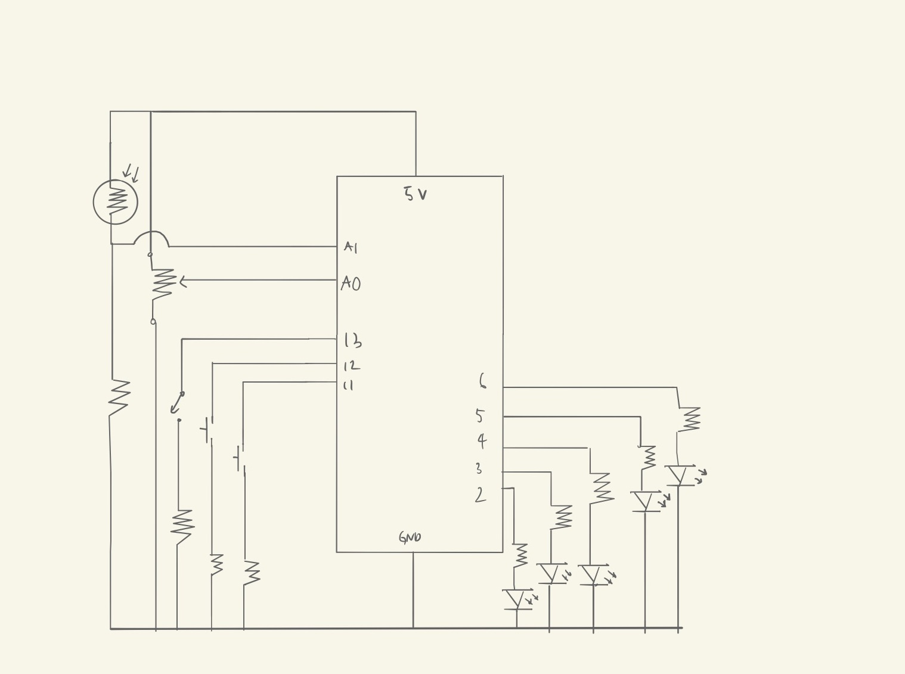

### Assignment 8: LED Escape Room

This project is a mini escape room with four different types of locks. Each lock requires a specific kind of combination (potentiometer + photoresistor, buttons + switch, potentiometer + switch, potentiometer + buttons), and if you unlock a lock, an LED lights up showing that you completed it. Locks that require a button will light up if you press both buttons then let go of one (as a hint), but will also blink gently when you press a single button/hold both buttons if you don't want glaring light in your eyes as you try to solve the puzzle.

#### The Idea & Result

This was another random idea that I came across while I was thinking about what to do while looking at the prompt. I thought about lights turning on and off, controlled by an analog input and digital input, then thought I could maybe make a sort of puzzle of the most random combos of sensors. I dubbed it an escape room, but it's not exactly an escape room. Escape room are actually a lot larger (obviously) and more fun, but I made do with what I had. Originally, I wasn't going to have any hints (the button thing), but escape rooms have hints so I thought I was being too cruel and added the button thing.

[Demo](https://drive.google.com/file/d/1jad2SpTs8iyRevMSQVJb5W_8irEtNH7N/view?usp=sharing)

#### The Code

Something different from the past assignments with Arduino (aka the one) is that I used classes in order to set 'locks' and their values. If you want a challenge, I suggest you don't read this bit of the code before playing, since it basically gives away the system (but not the values, which are randomized!).

    class Lock {
      public:
        int lockNum;
        int completionReq;        //lock type
        int startVal;             //starting value (this is changed depending on the lock type)
        int keyVal;          //value to unlock lock
        bool isComplete = false;

      //constructor
      Lock::Lock(int& lockNum, int completionReq, int startVal) {
        this->lockNum = lockNum;
        this->completionReq = completionReq;
        //change value according to completion requisite
        if (completionReq == 0) {          //switch + potentiometer + photoresistor
          keyVal = startVal + 350;
        }
        else if (completionReq == 1) {     //button + potentiometer
          keyVal = startVal * 2;
        }
        else if (completionReq == 2) {     //potentiometer
          keyVal = startVal;
        }
        else if (completionReq == 3) {     //switch + button
          keyVal = (int)random(2, 4);
        }
      }
    };

As I did with the last assignment, I used randomSeed() in order to get more-random values for the lock types and the values of those locks. I won't go into detail about how the values are set (since it's kinda obvious but also because I don't want to give things away).

#### The Circuit

The circuit was basically just mixing random sensors and LEDs on the breadboard. Here's the schematic:

#### Difficulties

One difficulty was the whole classes thing. It's been a while since I dabbled with classes in C++ so I had to spend an hour or so trying to get accustomed to all of the differences from it and Java (mainly how the data members and functions are labeled). Another was an extension of the classes, and it was getting them into an array. I had forgotten how to set the array as an array of pointers to a class, but once I remembered that things got a lot easier.

Also something that might help people is how you need to reference objects in arguments using the '&' in order to make direct changes to that object. I spent over an hour trying to figure out why my program wasn't working and this simple fix made the program run smoothly. Once again, stupid mistake (this one from me forgetting about C++ stuff). I really should stop making these.
