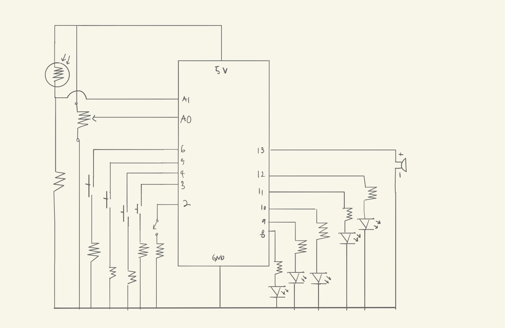

### Assignment 9: Adjustable Keyboard

#### Preface

Yes, this is what I was planning on doing for last week's assignment. I looked at the prompt for the production assignment and realized that the project I had in mind was actually a better fit for this assignment than for the last. And so, I decided that I would do the adjustable keyboard for this assignment.

#### The Idea and Result

Well, this kinda came from the whole reading about physical computing, that keyboards with touch or sensors are very common. Unfortunately, I don't actually have any touch sensors and the way that I was planning on doing touch (using photoresistors) required me having more than one photoresistor (this is why I wish we had access to the entire IM lab and its equipment )': ), so I ended up having to use buttons. *Ugh*. I'm sorry, it's just that these buttons aren't really an ideal form of input because they're so... *clacky* and hard to use.

Anyway, merely making a keyboard seemed way too simple, so I decided to add a potentiometer to add an adjustable aspect to it, so that by turning the potentiometer you could get lower/higher notes along the scale. This idea was inspired by how the keyboards are like in Garage Band for iOS devices, where you swipe to reach higher scales and stuff.

Here's how it turned out. Lots of wires and sensors and... *stuff*. But it works, and that's what's important.

#### The Code

The simplest way to understand this is by looking at the execution, as I made the entire thing almost entirely out of functions:

    //Execution

    void loop() {
    
      //Set analog values as variables
      int potPosition = analogRead(A0);
      int photoResist = analogRead(A1);

      //Serial.println(potPosition);

      //On or Off
      if (digitalRead(2) == 0) {
        digitalWrite(powerLED, false);
        isOn = false;
      }
      else {
        digitalWrite(powerLED, true);
        isOn = true;
      }

      //If on, play
      if (isOn) {
        //update keyboard
        updateKeyboard(potPosition);
        //if key is pressed, then light up LED and play note
        if (keyPressedCheck() && keyNum < 4) {
          playNote(potPosition, photoResist, keyNum);
          keyPressed = true;
        }
        else if (keyNum == 4) {
          turnOffAll();
          noTone(buzzer);
          keyPressed = false;
        }
      }
    }

On the surface, it's extremely simple. Just update the keyboard based on the potentiometer input, and if a button is pressed then play a note. Under the surface of is where it's at.

Updating the keyboard calls a single function, which is updateKeyNotes. This codes the "adjustable" part of the keyboard, and takes an argument called startkeyIndex.

    void updateKeyNotes(int startKeyIndex) {
      for (int i = 0; i < 4; i++) {
        //Serial.print((startKeyIndex + i)%7);
        keyboardNotes[i] = notes[(startKeyIndex + i) % 7];
      }
      //Serial.println("");
    }

What's interesting is *how* this argument is retrieved.

    int returnStartIndex(int potPosition) {
      //48 notes total, but only 4 keys at a single time. This means that there are 16 different segments of size 64.
      int scaleNum = (int)(potPosition) / segmentSize;
      //Serial.println( scaleNum );
      //If scale number is even, return the value of the scale number modulus 14 divided by 2
      if (scaleNum % 2 == 0) {
        //Serial.println( (scaleNum % 14) / 2 );
        return ( (scaleNum % 14) / 2);
      }
      //If odd, return (3+(scaleNum%14+1)/2)%6. The modulus 7 is because the numbers go over 7 (array size) when calculating the pattern.
      else {
        //Serial.println( (3 + ( (scaleNum % 14) + 1) / 2) % 7 );
        return (3 + ( (scaleNum % 14) + 1) / 2) % 7;
      }
    }

I think of this as my little moment of genius for this project, which stemmed from the frustrating lack of buttons or components I could use as keys. There were 4, but there are seven notes on a scale. This function checks scale and returns the start index of 4 notes using a pattern that I noticed after playing with numbers for a while. You see, when you write down each of the starting indicies for each iteration, you notice that the starting indicies for the even iterations increase by 1 every 2 iterations starting from 0, whereas odd iterations increase by 1 every 2 iterations. In addition, the difference between a full cycle of notes (if you've increased the indicies over and over until you're back where you started) is 14 iterations. The function takes this pattern and uses a modulo in order to get the segment (of 4 numbers) that you're at with the current potentiometer value –– the starting index, that is. This is then used to update the keys as seen in the function before this onem updateKeyNotes().

Besides that, there's also how the notes are played that makes things interesting.

    //Play note (take into account other sensors before playing note)
    void playNote(int potPosition, int photoResist, int keyNum) {
      turnOffAll();
      turnOnOne(keyNum);
      //If note is not sharp
      if (!checkSharp(photoResist)) {
        tone(buzzer, keyboardNotes[keyNum]*scaleOctave(potPosition), 1000);
        delay(100);
      }
      //Else (if sharp is not activated)
      else {

        (...)
        
      }
    }
    
The main function to focus on here is the scaleOctave() function. This is based on a chart that I found on frequencies of sounds online (Google is awesome).

The difference between each octave is a factor of 2. This means that if you have an initial value, the factor from that initial value to octave *n* is 2^(*n*-1). Anyway, using this I created a function that sets the multiplier to that so that I could scale the octaves based on the number key that was being played:

    //Scale octave of keyboard depending on potentiometer
    int scaleOctave(int potPosition) {
      int scaleNum = potPosition / segmentSize;
      int keyNumber = scaleNum * 4 + keyNum;
      int octaveNum = keyNumber / 7;
      int multiplier = 1;
      for (int i = 0; i < octaveNum; i++) {
        multiplier *= 2;
      }
      //Serial.println(multiplier);
      return multiplier;
    }
    
Once I was done with everything and understood how the scaling worked even better than I did before (you should've seen me messing around with numbers until something worked lol), I realized I could extend this to the initialization of the program itself so you could choose from which octave you want to start and which octave you want to end. #customized

    //Keyboard Initialization
    int startOctave = 1;                //octaves min is 0
    int endOctave = 9;                  //octaves max is 10
    int octaveCount = 9 - startOctave;
    int totalNotes = octaveCount * 7;
    int segmentCount = totalNotes / 4;
    int segmentSize = 1024 / segmentCount;

    //Notes
    const float noteC = 16.35 * pow (2, startOctave - 1);
    const float noteD = 18.35 * pow (2, startOctave - 1);
    const float noteE = 20.60 * pow (2, startOctave - 1);
    const float noteF = 21.83 * pow (2, startOctave - 1);
    const float noteG = 24.50 * pow (2, startOctave - 1);
    const float noteA = 27.50 * pow (2, startOctave - 1);
    const float noteB = 30.87 * pow (2, startOctave - 1);
    float notes[] = {noteC, noteD, noteE, noteF, noteG, noteA, noteB};

    //Sharps
    const float sharpC = 17.32 * pow (2, startOctave - 1);
    const float sharpD = 19.45 * pow (2, startOctave - 1);
    const float sharpF = 23.12 * pow (2, startOctave - 1);
    const float sharpG = 25.96 * pow (2, startOctave - 1);
    const float sharpA = 29.14 * pow (2, startOctave - 1);
    float sharps[] = {sharpC, sharpD, sharpF, sharpG, sharpA};
    
I dunno about you, but I think this was really cool, too. Oh, I only found out about the pow() function at the end, so the playNote() function uses my own scaleOctave() function, which has a for loop, instead of the pow() function.

#### The Circuit

The wiring for this assignment was pretty tricky, not so much because of anything technical but because there were *so many wires*. Maybe I shouldn't have added the LEDs since they weren't essential, but they look nice so I think it's still okay. I was on the verge of running out of ports to use (had 1 left at the end), but got everything hooked up. Here's the schematic:

#### Difficulties

Okay, so let's list some problems I had.

The first, obviously (well maybe it isn't but it was for me) was the whole "adjustable" part of the code that wasn't hardcoded but was made so that it would be relative to any changes in the octave start/end. The pattern took *so freaking long* to discover, mostly because I was trying to find an addition-/subtraction-based pattern in the increments of the numbers. I spent an hour or two writing the numbers down over and over and over again trying to see if something was visible and was on the verge of just hardcoding when I thought about the problem from the perspective of *indicies*, rather than frequencies. I realized that there was a pattern in the even and odd iterations, respectively, and that was my *omg what is this* moment during this project.

Then I had a problem where F# wasn't working. It wasn't working because... if you look at the video, you'll notice that the photoresistor is bent *away* from the breadboard. This wasn't an accident. You see, because the yellow LED was right next to the photoresistor, this ended up making the photoresistor unable to know whether there was a finger over the thing or not because it was so bright. Yep, and I spent around 30 minutes trying to figure out what was wrong, starting from printing out all the variables to resetting the entire circuit. Yes, stupid, stupid, *stupid* mistakes :/
