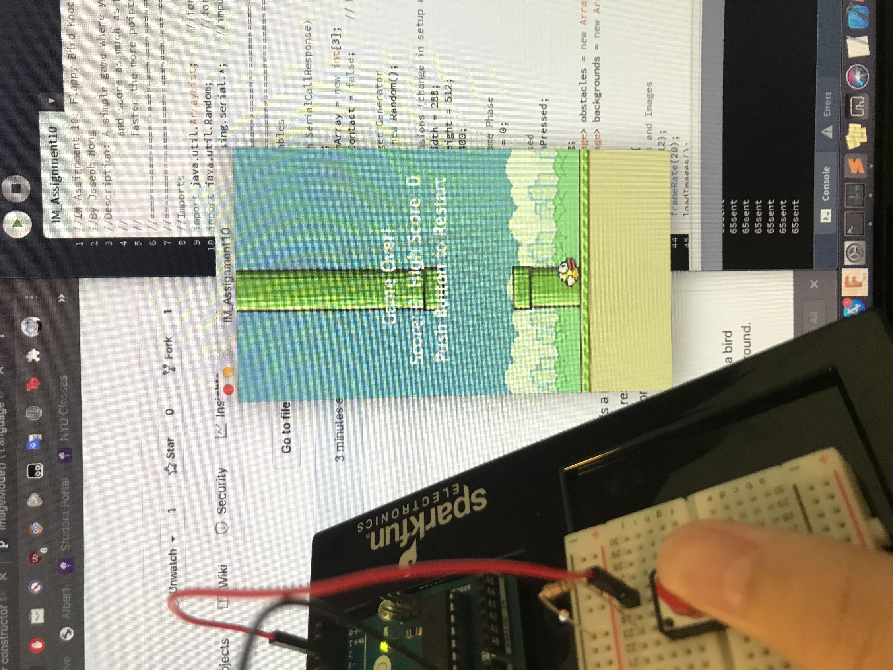
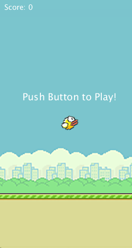
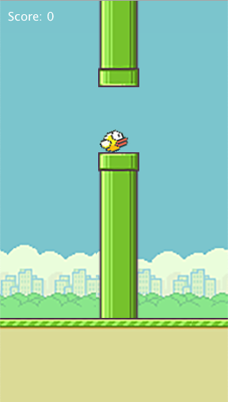
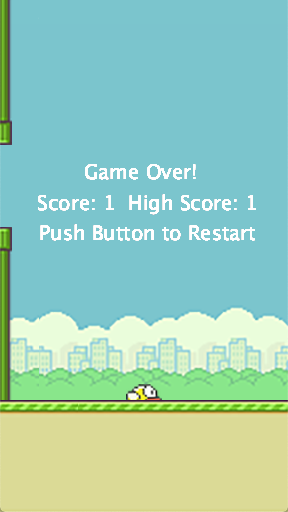
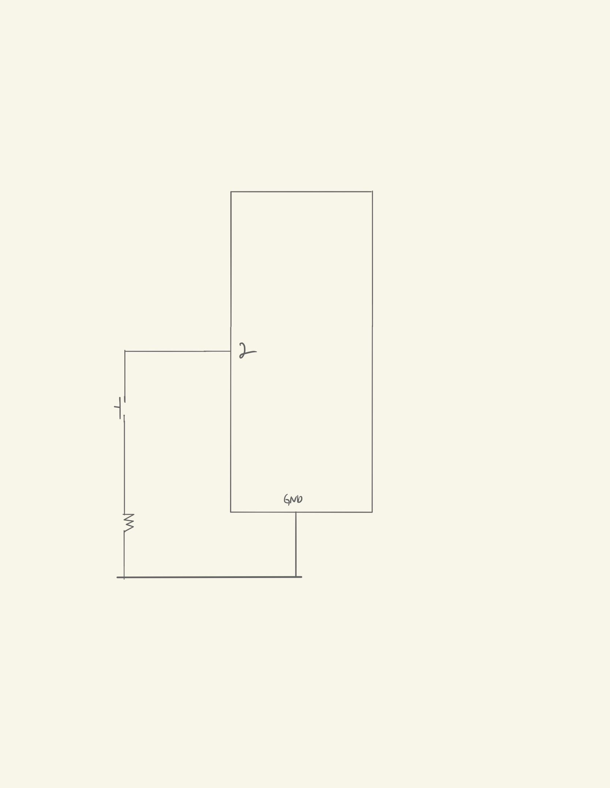

### Assignment 10: Flappy Bird Knockoff

So. I don't actually know if this will work, but I want to make a remake of Flappy Bird using a button. It's a super simple interaction, I *know*, but it's kinda hard to get creative with this, given the limited skills, time, and resources that I have. I thought of making an escape room, Escape Room 2.0, but that'll either be the final project or just something I make in my free time.

#### The Idea and Result

I don't really think I need to introduce Flappy Bird, but it's basically a game where you tap the screen to make a bird on the screen fly. Every tap makes it go up by a certain amount, and if you don't tap the screen it'll fall to the ground. Also, there are obstacles that you need to avoid hitting, too. If you hit a pipe, you lose; if you hit the ground, you lose.

So that's the game. What I made ended up being really similar (because I got my hands on the image assets, yay!). It has almost all the same stuff (minus a pause button and those medal things). Instead of tapping, I changed it to a button. You press to start, press while playing, and press to restart if you lose.

[Here's a intro/demo of the game!](https://drive.google.com/file/d/184I3wFvarjWNd1MklSBSoUiWSwLQtOfP/view?usp=sharing)

#### The Schematic

So, the interaction here between Arduino and Processing is extremely simple: just a button click. So, just a single button.

#### The Code

The game was split into three overall classes (minus the game class); Entity, Bird, and Obstacle. These all had their locations and velocities, but something that I changed was who was doing the moving. Basically, only the obstacles and the background are moving and the bird is staying the same. Because of this, I didn't need to worry about having to adjust middleX for all of the other entities and just needed to set a velocity and delete the obstacles once they left the screen. Here's the code for the obstacle updating in the game. It shows how score is added and how the calculations are made to see if the bird has hit the pipes or not:

    //Update pipes
          for (Obstacle o : pipes) {
            //If bird passed through pipes and the game hasn't ended, score ++
            if (o.locX + o.imgWidth <= screenWidth/2 ) {
              if (screenWidth/2 - stageSpeed/2 <= o.locX + o.imgWidth && o.locX + o.imgWidth <= screenWidth/2 + stageSpeed/2) {
                score++;
              }
              //Delete object if out of screen
              if (o.locX + o.imgWidth <= 0 ) {
                deleteObjectList.add(o);
              }
            }
            //If bird is within range of obstacles, make sure that it is between the pipes
            if (o.hitRangeX1 <= birdie.hitRangeX1 && birdie.hitRangeX1 <= o.hitRangeX2 || 
              o.hitRangeX1 <= birdie.hitRangeX2 && birdie.hitRangeX2 <= o.hitRangeX2) {
              //If the bird is in the hitbox of the pipes (collides), it dies
              if (!(o.hitRangeY1 <= birdie.hitRangeY1 && birdie.hitRangeY1 <= o.hitRangeY2) || 
                !(o.hitRangeY1 <= birdie.hitRangeY2 && birdie.hitRangeY2 <= o.hitRangeY2)) {
                birdie.isAlive = false;
              }
            }
            o.update();
          }
          pipes.removeAll(deleteObjectList);

The special thing here is how I used hitboxes for the entities. These are unique to each class (bird's hitbox changes in the Y values while the pipes change in the X values), and are updated every frame. Here's an example, using the pipes as a reference:

    void updateLocRange() {
      locX += velX;
      locY += velY;
      hitRangeX1 = locX - imgWidth/2;
      hitRangeX2 = locX + imgWidth/2;
      hitRangeY1 = locY - 75;
      hitRangeY2 = locY + 75;
    }
    
So, putting these two pieces of code together, the game checks if the bird's hitbox is in the range of the pipes, and if it leaves the range then as it leaves a point is added to the score.

Another fun thing I implemented was rotating the bird whenever the button is pressed (whenever it goes up). I recalled that there was a similar feature in the actual game, so I tried to implement it using the image editing (pushMatrix() ) stuff that we learned a while back. I linked this to the velocity of the bird, which is negative when going up and positive when going down. Here's the code:

    void display() {
      pushMatrix();
      float rotation = map(velY, -10, 10, 310, 350);
      translate(locX, locY);
      rotate(radians(rotation));
      imageMode(CENTER);
      image(birdImg, 0, 0, imgWidth, imgHeight);
      popMatrix();
    }

#### Difficulties

One problem I came across was trying to get the two programs to communicate to one another. For some reason, they just weren't, even though the right things were being sent to the programs. Turns out that the problem was that the system I used in order to prevent button holding was making the byte sent to Processing from the Arduino disappear amongst the hundreds of other bytes that were being sent in a split second. Once I got rid of the anti-holding part of the code, it worked. At the expense of looking sophisticated, but as long as it works it's good... right?
