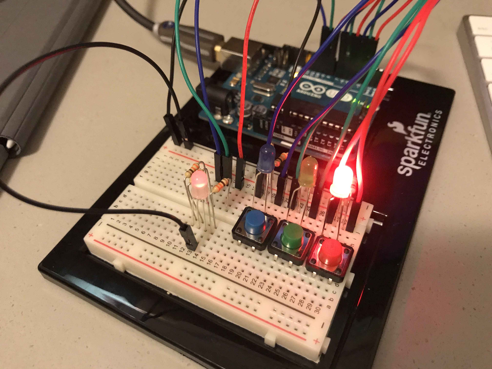

### Assignment 7: 3-Light Game

This is a simple game where you match the order of lights to a pattern shown at the beginning. There are a total of three phasees, each one increasing in difficulty (I've only finished it once). When you pass a phase, the three LEDs will light up in turn and "unlock" a color in the RGB LED. Once you have all three, the victory sequence will ensue and the game will end! If you lose, the lights will flash three times and reset. Click a button to start again. Here's a pic:

Here's the schematic:

#### The Idea

When I heard "a puzzle using 3 lights and buttons" I immediately thought of this thing. I remembered it from when I played Among Us, where there was a task where you had to follow the order of buttons that lit up. I thought that I'd create something similar (but on a much smaller scale).

So, normally, this was going to end at just three LEDs and one phase. However, I had a sudden burst of inspiration in the shower (just like everyone does) and thought that I could create "phases" so you're unlocking a code of some kind. As I sat down and worked with random(), I realized it was borderline impossible to remember the patterns if each phase kept changing. I looked into randomSeed() and found that if I put in a static value (i.e. 10), then the pattern would remain the same no matter what (since randomSeed() is taking the argument to set an anchor basically)! I just thought this was clever, since I didn't have to change most of my code and could implement the phases with randomSeed(). I just thought that was kinda clever :))

Update: I set patternType, which is the variable that goes into randomSeed(), to be changed to a new number every game, which means that different patterns will be used every game! Thought this was really cool~!

#### Difficulties

So, when I first started, I wanted to use the STL vector but realized that it wasn't working. Like at *all*. Turns out downloading and using libraries is a lot more complicated than I thought it was, because I kept getting "error compiling for board arduino uno" as an exception, which made me end up using normal arrays (err *static* arrays).

That was great and all, and everything was going smoothly until I realized that I made a slight mistake with the default setting for the pressed button. I set it as 0, since I was going to say that each respective button was 1, 2, and 3, but then that started messing up the lights that turned on. I didn't mind it at first and thought I'd get to it as it came, but it kept piling up until I had no idea which light I was turning on with a button, and the game itself got messed up as well. It was because of the way that I was calling the lights to turn on using the indicies, and it was very inconvenient having to use the buttons as 1, 2, and 3 because I needed to subtract 1 when referencing a light or pattern and add 1 in other cases. Because of that, I rewrote the entire thing with the default pressed button as 3, which made my life a lot easier. It was a really stupid mistake that kept piling up because I thought it'd be okay, but I realized that I was having to hardcode each variable as a result of it. Glad I changed it before I finished the entire thing.

Spent about an hour trying to get the stupid RGB LED to work before I realized that I never actually set them to *turn on*. I'm really, *really* good at making stupid mistakes, as you can probably tell. At least I found what was wrong!

Besides that, there isn't much else, unless you count how bright the LEDs are. I know there's that command to lower the brightness, but it's too much work to change the entire code. My eyes hurt so bad from test-running this thing over and over...
