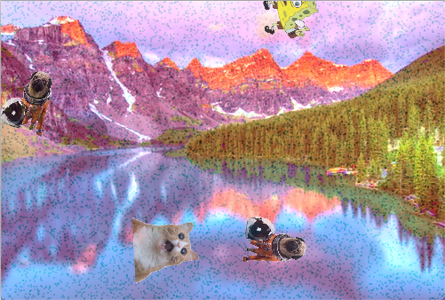

### IM Assignment 5: Trippy Image

#### Why?

Honestly, I have no idea. I have no idea why this idea came upon me, or why I thought a pug in an astronaut suit floating around the screen, spinning around, would be funny. I just... *did* (I was also rather tired at the time). Anyway, this is a work of art(?) where you're basically really, really high. There are a lot of color changes and random objects involved. Each click creates a new wave of confusion and "Why in the world would he do this?" moments. 30 clicks results in an 'overdose' and reset. No actual drugs were involved, so it's all good.

#### The Design (and Problems)

Like I said beforehand, I'm not really sure what came upon me. I think it was because I saw the whole image maniuplation tutorial and wondered for a moment, "Is that what it's like to be high?" 

Anyway, I basically took a nice, calm image and "high"-ed it. I tried to make it flash colors, change tints (by adding values to the pixels), and have random objects floating and spinning around the screen. I planned on only having the pug at first, but I added some more because it felt empty.

One challenge that I ran across (among the many) was trying to manipulate the image in multiple ways at once. I would try to call the image and change it in multiple functions, but it wouldn't work out properly. I realized what the issue was, but only after I finished writing all of the code. Here's an excerpt:

    loadPixels();
    for (int i = 0; i < pixels.length; i++) {
      float r = red(mainImage.pixels[i]);
      float g = green(mainImage.pixels[i]);
      float b = blue(mainImage.pixels[i]);

    //constrain size
    r = constrain(r, 0, 255);
    g = constrain(g, 0, 255);
    b = constrain(b, 0, 255);

    //Change pixel to closest RGB value (whichever has the highest value)
    if (compare(r, b, g)) {
      pixels[i] = color(r + rTint + colorChangeValue, g + gTint + colorChangeValue/2, b + bTint + colorChangeValue/2);
    } else if (compare(g, r, b)) {
      pixels[i] = color(r + rTint + colorChangeValue/2, g + gTint + colorChangeValue, b + bTint + colorChangeValue/2);
    } else if (compare(b, r, g)) {
      pixels[i] = color(r + rTint + colorChangeValue/2, g + gTint + colorChangeValue/2, b + bTint + colorChangeValue);
    } else {
      if (i>0) {
        pixels[i] = color(pixels[i-1]);
      }
    }
    }
 
So, the first thing you probably noticed was that I wasn't actually manipulating the image, but rather using the image to change the pixels in the screen (not the image). Also, this was probably the reason why using functions with this format only displayed the last function that was called. I got past this by adding different variables as values in the same function, rather than in a different function. It was kind of a stupid mistake, but it also affected the near-entirety of my code, which taught me the lesson to nip problems in the bud before the get bigger.

Also, when I tried to get the program to reset, I found that it *wasn't* resetting. I got over this because I went over the entire program and saw that I hadn't reset the global variables with the reset and setup() call. This was also kind of a stupid mistake...

Other than that, there weren't that many problems. I didn't get to make the program as complex as I wanted it to be (for the very reason that I messed up my function writing but also because I lack the expertise), but it still made me laugh regardless, especially when I didn't have a limit on the number of clicks.

#### I'm sorry.

I have no idea why I got this idea, and the simplicity of the problems I had (and couldn't solve) is rather embarrassing. The program works, but it doesn't have the same kind of polish that I like to have on my projects because I don't have much experience in image manipulation (so I didn't know what I was doing... but still).

###### Images are from Google Images :)
