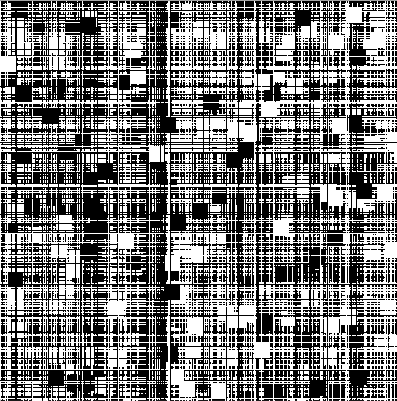

## Assignment 2: Repetitive Art

This utilizes repetition and randomization in order to create a piece of art. It was a little bit confusing on where I
needed to put certain variables (some needed to be out of the loop and others needed to be in), but I figured it out! The
way that randomization creates such pretty things is really cool :) I realized how it can be used to create really nice and
pretty designs. The code itself is basic, just making lines and adding a few shapes in random locations, and I felt tempted 
to make it a bit more complicated, but I came to the conclusion that some things are best left simple. It looks really cool
like this, after all.
