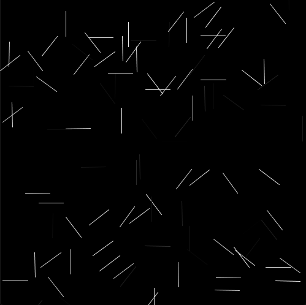

## Assignment 3: Object-Oriented Artwork

This piece was inspired by what Casey Reas showed in his lecture when he was trying to depict the beauty of randomization.
I realized that I didn't have the skill that he had when he wrote programs that created these epic designs, so I ended making
something that was a little bit more suitable to my skills.

In this piece, lines appear whenever circles come in contact with one another. This was the piece from Reas that especially inspired
me, but I didn't have the skill to recreate, so I made it so that the circles (hidden) could create lines whenever they were
touching, but they didn't bounce off each other or have any kind of real physics (meaning they bounce forever).

Making the equation work and getting the lines to draw whenever two circles (they're hidden on the actual run) meet was kinda
difficult but I made it work somehow (through some thoughtful hardcoding and stuff from geometery).

While working on this project, I kinda had one of those revalations that people get from time to time about life and portrayed
it here. The first phase (initial) shows the surface level connections that we make in life, or maybe the decisions that we believe set
our lives in a different direction. The second phase (after a click) shows the all of the connections that go unnoticed, those
moments that we didn't (and probably will never) realize had an affect on who we are today. It's just some food for thought :)

[Link to (Download) Raw Video](https://github.com/jhongover9000/intro2im/blob/master/September29/Assignment3.mp4?raw=true)
