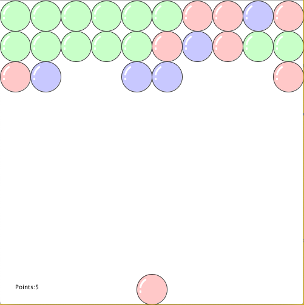

## Assignment 3: Object-Oriented Game

(Game Screenshot)

This is a game that's similar to a "bubble shooter game" (I didn't actually know what it was called until I searched it up).
You basically shoot an orb at the ones at the top of the screen with the same color as yours, which will "pop" them. You can
also bounce the orb off of the boundaries to get the tricky ones (I can't do it though; I lack the skills). When popping an
orb, if the adjacent (above, left, right) orbs are the same color, they will also pop. Each popped orb will give you a point, and when you pop all of the orbs, you win!

(Bubble Shooter Example)

This came to mind at some point (I don't really know why or where it came from) and I was like, "huh, let's give it a shot".
However, one thing that I didn't realize was how difficult it would be to actually program such a game. At first, I was
planning on adding a row every turn and making the orb become a part of the top rows, but I quickly realized that this was
*way* to difficult for me to pull off, so it just became a "pop them all" kind of thing. In addition, the reason behind 
"adjacent" and not "all the colors that are touching" is because I messed up on the recursion function and I couldn't get it
to work so I had to settle with just the adjacent orbs that match colors disappearing.

Another problem was how to find when the player's orb hit the passive orbs at the top. In the end, I used Pythagorean's Theorem
to calculate when the orbs' centers became twice the length of the radius, which was a lot simpler of a solution than I'd
imagined.

After I'd done most of the programming, I realized that the game was ending early, before all the orbs were popped. I didn't
understand what was going on until I looked through the entire code and found that the point system that I had created was 
flawed in that it was rewarding the player for points they had already received. This was because of the way I had been 
"popping" the orbs; I was checking if the adjacent orbs were the same color and giving points then hiding/popping them if 
they were. What I didn't realize was that if the orbs were hidden but were the same color, the status I gave them using 
"hidden = true" would activate either way (since it wasn't conditional) and the player would be awarded points again. I 
fixed this by adding another condition, that if the orbs were the same color *and* they weren't hidden, the player would be 
awarded points.

I guess something that I thought was interesting was how I made the game relative to the number of rows at the start, 
meaning that orbs will be placed in rows according to the value you assign at the beginning. This was done through coding:

      while (tempY <= orbSize + (startRowNum-1)*orbSize*2) {
            Orb tempObj = new Orb(tempX, tempY, 0, 0, colors[rand.nextInt(3)]);
            orbList.add(tempObj);
            tempX += (orbSize*2);
            if (tempX + orbSize > screenWidth) {
              tempX = orbSize;
              tempY += (orbSize*2);
      }
      
This basically configures the orbs so that they'll fill the entire row, then move onto the next, continuously until the 
number of wanted rows are created. I thought it was interesting because it was relative & dynamic :)
