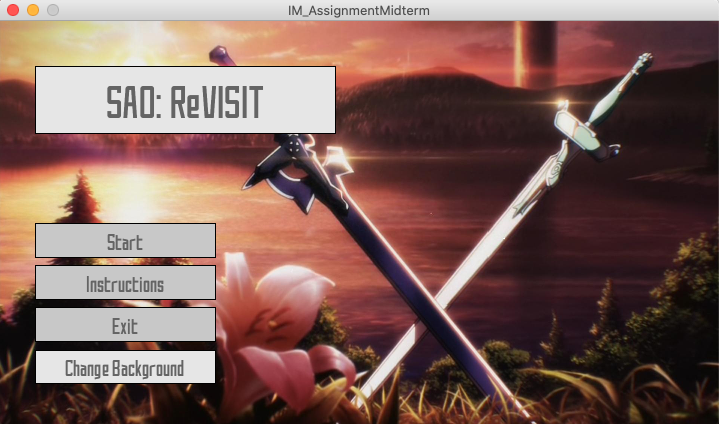
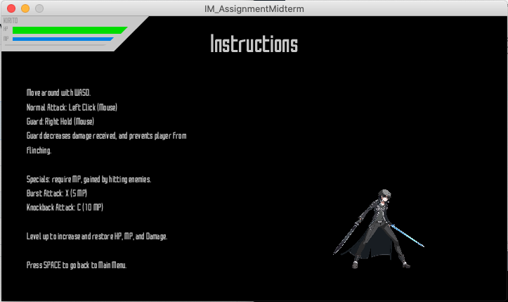
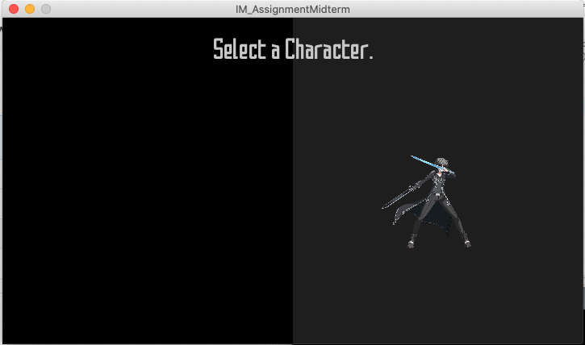
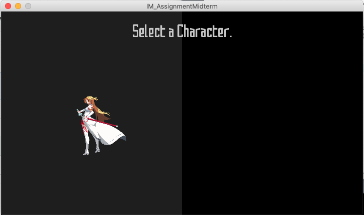
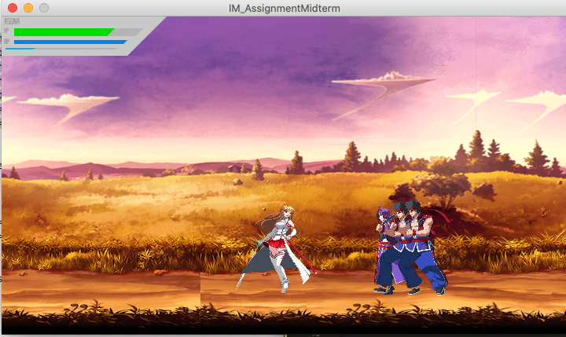
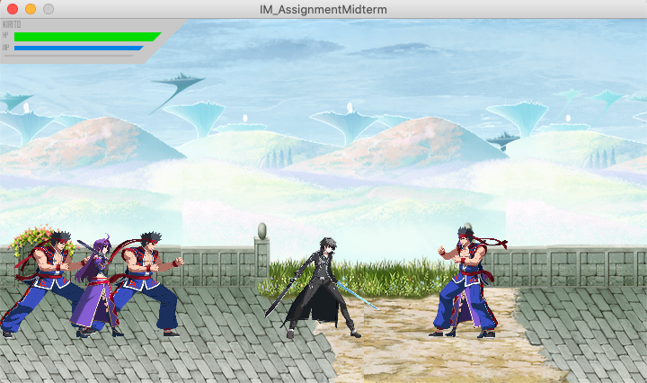
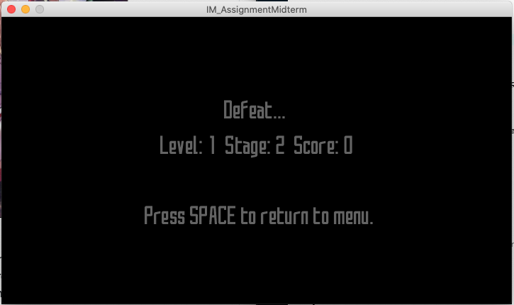
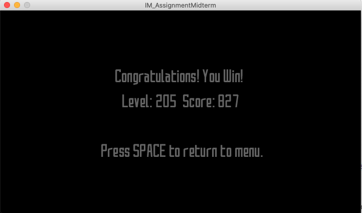

### Midterm Project: A Game.

So. The midterm project. I guess you could say that this is more or less a success. I'll introduce the game before I go into the whole thought process and challenges bit.

#### The Game

What I made is your simple generic sidescroller, with some fun bits and pieces of random ideas (by random I literally mean I was in the middle of coding some things and thought "oh, that sounds fun" and suffered for 4 hours trying to get it to work). You fight through stages of enemies, then take on a boss. However, each stage increases in difficulty, so you need to decide whether you want to keep levelling up or you want to proceed to the next stage. Every time you level up, you gain a bit more HP, MP (needed for skills), and DP (damage points). You also can guard against enemy attacks for reduced damage, but be aware that you have a limited number of blocks before you start taking the full brunt of the attacks!

Here are some screenshots and explanations of the game/random ideas I had.

##### Title Screen

This is the title screen. It looks decent, but simple, but there's a catch –– do you notice that button that says "Change Background"? Yes, this is one of those random ideas I had when I was making the interface. I got the idea from Nier: Automata, at least I'd like to say I did (since it was a random idea I thought was really cool). Every 500 frames, the background changes. Of course, it's all SAO themed (sorry for being a weeb). In addition, there's music, too, which is always a plus. When I made this I just sat around for a few minutes watching the screen change and listening to the music.

##### Instruction Screen

This is the instruction screen. Do you notice something about it? Yes, that's right. It's an *interactive* instruction screen. There are some tips and controls on the side, but you don't really know what you can do unless you try it yourself. You can make the player move, attack, block, and everything it can do in the game itself. This was also a random idea which stemmed from my character selection idea, which was also random, but I'll show you that next.

##### Character Selection

The character selection screen is pretty cool, tbh, even if I made it. Basically, there are two main characters and you can choose between the two of them. You can't see it here, but they actually have separate animations that are exclusive to the character selection page. You can choose one or the other, and the game will link it to your player and *voila*, you're playing with the character you selected.

##### Stages

Nothing too interesting about the game, since it's pretty generic. You fight the enemies who spawn randomly across the map, and gain EXP with each kill. Once you reach the end of the stage, you have the option to go up to the next stage or stay and farm more levels (classic JRPG-style). I wanted people to go through the farming to get to the goal. The boss is insanely, and I mean *insanely* strong, which is why you want to build up as many levels as possible. The game itself takes a good 30 minutes to an hour if you want to beat the boss, but if you tweak the settings (change the level multiplier of the boss, which is normally at 5 –– which makes their level 100+), then you can clear it faster. Oh, there's stage music as well, for normal stages and an exclusive one for the boss stage. This mentality of farming (doing the same action over and over to gain a small reward) is one that I want to introduce to first-time players ;)

#### The Idea

The idea for this game came from about a year ago. I attempted to do something similar to this, but epically failed. I didn't know what I was doing, but this time I had a good grasp of classes and functions so I decided to give it another go. This is mainly because I want to make a game like this with my own hands (and I want to show my brother that I am, indeed, learning things from IM and CS). Anyway, I've always been an SAO fan so I wanted to do something like this. I actually wanted to add videos to the thing but it didn't really work out, with time (and lag from the game) and all.

#### Difficulties.

There were pretty much *only* difficulties for the entire first half of the project. Check out my journal for details on my suffering! Starting from unaccessible files to nullPointerExceptions and targetInvocation errors, I had pretty much every error you can get when dealing with objects and classes. I got through these mostly because I just looked for messed up lines of code –– I feel really stupid because 90% of these problems were solved by changing one line of code. *One line*. The last two days were a mega-push because I decided last minute that I *did* want to go through with the entire project and chose not to settle (at least not that much). I didn't get to add player sound effects (finding the right ones takes too long) and movies (I might add these later, after I turn in this project, just because I want to say I made an SAO game), but I did get most of the features I wanted. On top of that, my random ideas were really nice, too (but were also part of the reason why I didn't have enough time to add SFX and movies).

#### Warning

So, as you can probably see when you open the folder, there are a *lot* of files. This is because the sprites that I found were not your big sprite sheet but were rather individual images, *which I had to rename by hand* (<-- that took me a good 3 hours). Also, there's a font file somewhere in there, so those are just some of the many things I had to add because I couldn't get the program to direct itself to the current working directory using get.SystemProperty("user.dir"). If you want to play, you're going to have to download all of those files or at least one set of character moves and change up the code.

###### Resource for Sprites: https://www.spriters-resource.com/
