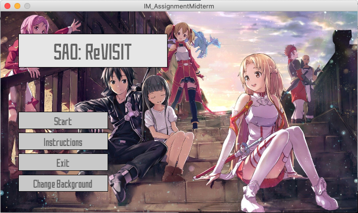
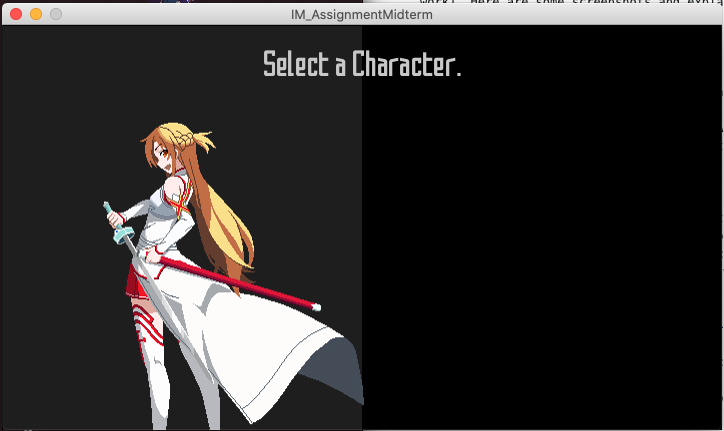
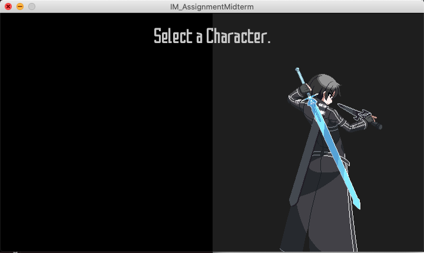

### Midterm Project: A Game.

So. The midterm project. I guess you could say that this is more or less a success. I'll introduce the game before I go into the whole thought process and challenges bit.

#### The Game

What I made is your simple generic sidescroller, with some fun bits and pieces of random ideas (by random I literally mean I was in the middle of coding some things and thought "oh, that sounds fun" and suffered for 4 hours trying to get it to work). You fight through stages of enemies, then take on a boss. However, each stage increases in difficulty, so you need to decide whether you want to keep levelling up or you want to proceed to the next stage. Every time you level up, you gain a bit more HP, MP (needed for skills), and DP (damage points). You also can guard against enemy attacks for reduced damage, but be aware that you have a limited number of blocks before you start taking the full brunt of the attacks!

Here are some screenshots and explanations of the game/random ideas I had.

##### Title Screen

This is the title screen. It looks decent, but simple, but there's a catch –– do you notice that button that says "Change Background"? Yes, this is one of those random ideas I had when I was making the interface. I got the idea from Nier: Automata, at least I'd like to say I did (since it was a random idea I thought was really cool). Every 500 frames, the background changes. Of course, it's all SAO themed (sorry for being a weeb). In addition, there's music, too, which is always a plus. When I made this I just sat around for a few minutes watching the screen change and listening to the music.

##### Instruction Screen

This is the instruction screen. Do you notice something about it? Yes, that's right. It's an *interactive* instruction screen. There are some tips and controls on the side, but you don't really know what you can do unless you try it yourself. You can make the player move, attack, block, and everything it can do in the game itself. This was also a random idea which stemmed from my character selection idea, which was also random, but I'll show you that next.

##### Character Selection

The character selection screen is pretty cool, tbh, even if I made it. Basically, there are two main characters and you can choose between the two of them. You can't see it here, but they actually have separate animations that are exclusive to the character selection page. You can choose one or the other, and the game will link it to your player and *voila*, you're playing with the character you selected.

#### The Idea

